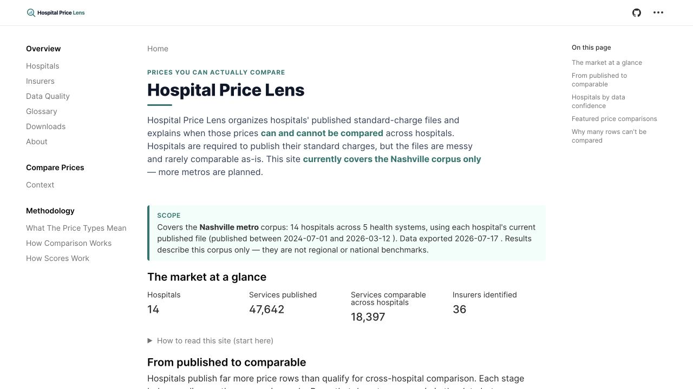
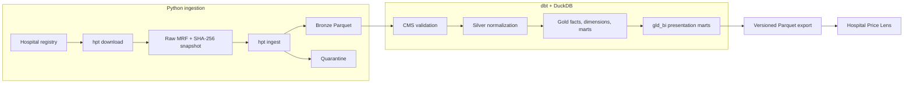
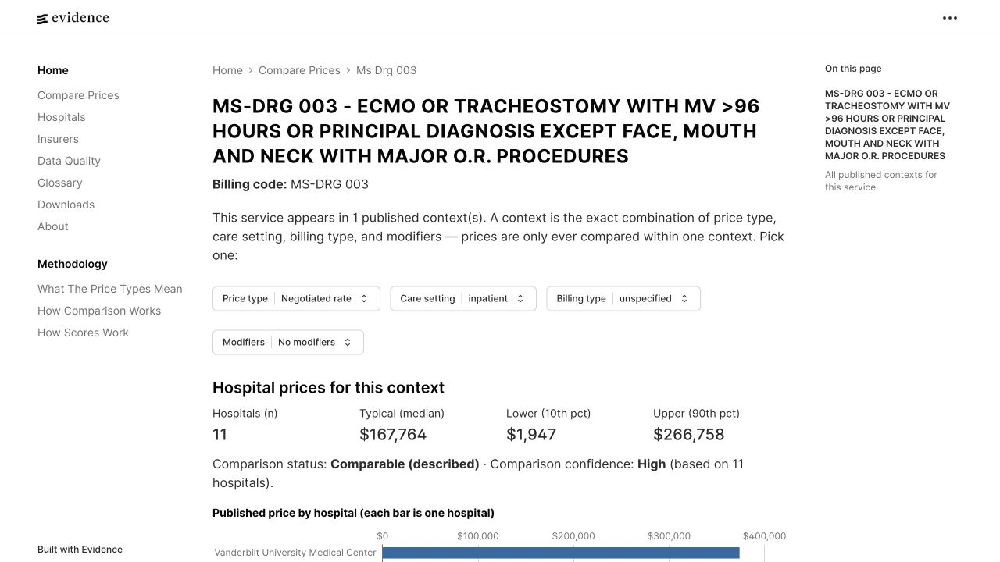

# Hospital Price Lens

A reproducible data pipeline and public analytics product that turns fragmented
CMS hospital price files into lineage-preserving, comparison-ready market data.

[Explore the live project](https://hospitalpricelens.com) ·
[Technical documentation](docs/README.md) ·
[Comparison methodology](docs/decisions/0017-gold-comparability-framework.md)

[](https://hospitalpricelens.com)

## Project At A Glance

<!-- portfolio-metrics:start source=hospitalpricelens.com exported=2026-07-11 -->
| Current Nashville release | Value |
|---|---:|
| Hospitals | **14** |
| Health systems | **5** |
| Published services | **47,642** |
| Services comparable across hospitals | **18,404** |
| Identified insurers | **36** |

The current public release uses one published file per hospital and was exported
on **July 11, 2026**. Results describe this Nashville-area corpus; they are not
regional or national benchmarks.
<!-- portfolio-metrics:end -->

## Why This Project Exists

US hospitals publish machine-readable price files, but the files are difficult
to analyze together. They can be multi-gigabyte JSON or CSV documents with
different layouts, unstable URLs, nested payer contracts, mixed code systems,
publisher-specific headers, and incomplete comparison context.

Hospital Price Lens makes that data usable without hiding its limitations. It
captures source snapshots, preserves raw values, validates CMS rules, normalizes
entities in dbt, and publishes only comparisons that meet explicit methodology
and denominator requirements.

## What I Built

- A registry-driven downloader with streaming HTTP, SHA-256 change detection,
  Type-2 snapshot metadata, retries, and `fsspec` storage.
- Streaming parsers for CMS JSON, CSV Tall, and CSV Wide layouts, producing
  source-faithful Bronze Parquet and structured quarantine output.
- A dbt/DuckDB warehouse with queryable validation, normalized Silver models,
  conformed Gold dimensions, an atomic rate fact, a multi-code bridge, benchmark
  marts, and data-readiness scorecards.
- An explainable comparability framework that separates rankable dollar prices
  from percentages and algorithms, retains blocker reasons, and suppresses
  cohorts below a three-hospital denominator.
- Nine presentation marts and a static Evidence application that publishes
  market, hospital, payer, data-quality, methodology, and downloadable-data
  views without exposing the working warehouse.
- Run-level and snapshot-level lineage connecting every modeled observation back
  to its source URL, filename, file hash, and ingestion event.

## Architecture



Python owns acquisition and structural parsing. dbt owns semantic normalization,
data-quality exclusions, payer matching, amount semantics, and analytical logic.
Evidence reads only exported presentation Parquet, so the website cannot redefine
comparability in page-level SQL.

See the [architecture overview](docs/architecture/overview.md) and detailed
[Gold schema](docs/architecture/gold-schema.md).

## A Key Finding: Published Does Not Mean Comparable

The public product makes the comparison funnel visible rather than ranking every
published number as though it represented the same thing.

| Comparison gate | Price rows | Share of published |
|---|---:|---:|
| Published in current hospital files | 79,094,586 | 100.0% |
| Has a code usable across hospitals | 77,479,175 | 98.0% |
| Has full service context | 45,127,753 | 57.1% |
| Has a directly rankable dollar price | 18,005,569 | 22.8% |
| Context is reported by at least 3 hospitals | **13,408,216** | **17.0%** |

Rows that fail a gate remain available for diagnostics; they are excluded from
rankings with an explicit reason. Scores measure the usability of published data,
not quality of care or legal compliance.

[](https://hospitalpricelens.com/compare/ms-drg-003/)

The live comparison view keeps the service context, hospital denominator,
percentile range, and confidence label beside the prices they qualify.

## Engineering Decisions

### Preserve first, normalize later

Bronze remains source-faithful, including odd nulls, duplicate records, raw payer
strings, and mixed code systems. Structural parsing belongs in Python; business
semantics belong in dbt. This keeps normalization reversible and auditable.

### Keep the rate fact atomic

One hospital charge item may carry several billing codes. The Gold fact stores
one reported amount cell per row, while a bridge represents the many-to-many code
relationship. This prevents code expansion from duplicating monetary facts.

### Treat comparability as a data contract

Price rankings require a usable code, aligned service context, a rankable amount,
and a sufficient hospital denominator. The contract and its blocker vocabulary
are defined in dbt and tested before publication.

### Bound local analytical workloads

The full Nashville corpus can exceed a small machine's DuckDB spill budget.
Snapshot replacement, hospital-batched builds, and per-snapshot orchestration
bound peak memory without sacrificing source lineage.

The rationale behind these choices is captured in the
[architecture decision records](docs/decisions/README.md).

## Technology

| Concern | Tools |
|---|---|
| CLI and ingestion | Python, Typer, HTTPX, Polars, ijson |
| Storage and interchange | fsspec, Parquet, PyArrow |
| Modeling and analytics | dbt, DuckDB, SQL |
| Data contracts | Pydantic, dbt tests, pytest |
| Public reporting | Evidence, Svelte, static Parquet exports |
| Quality automation | Ruff, GitHub Actions, offline end-to-end fixtures |

## AI-Assisted Engineering

The repository is designed for responsible continuation with Codex, Claude Code,
or Cursor:

- [`AGENTS.md`](AGENTS.md) is the canonical project contract.
- [`CLAUDE.md`](CLAUDE.md) imports that contract instead of duplicating it.
- [Cursor rules](.cursor/rules/) add small, path-scoped instructions only where
  they are useful.
- Detailed references are loaded by task rather than placed in every agent's
  initial context.
- Tests, linting, dbt assertions, and human review enforce correctness; agent
  instructions do not replace executable checks.

The [AI development guide](docs/ai/README.md) explains the context architecture
and maintenance policy.

## Quickstart

Requires Python 3.11+ and DuckDB 1.5.2+.

```bash
python -m venv .venv
source .venv/bin/activate
pip install -e ".[dev,warehouse]"

make test
make lint

hpt download
hpt ingest
```

Build a scoped warehouse through the project CLI:

```bash
make dbt-deps
make export-hospitals-seed
hpt run-dbt --command build --seeds --hospital-ids vumc
```

Always invoke dbt through `hpt run-dbt`. A full-corpus local build should use
hospital batches of approximately four or the orchestrator's per-snapshot mode.
See [Getting Started](docs/development/getting-started.md) and
[Snapshot-Scoped Runs](docs/development/snapshot-scoped-runs.md).

## Repository Map

```text
src/hpt/        Python package and CLI
tests/          pytest and offline end-to-end coverage
transform/      dbt project targeting DuckDB
apps/evidence/  public static reporting application
docs/           architecture, methodology, and development references
scripts/        build, export, and fixture utilities
```

Local MRFs, Bronze Parquet, DuckDB databases, exports, and logs are ignored by
git.

## Documentation

- [Documentation index](docs/README.md)
- [Architecture overview](docs/architecture/overview.md)
- [Gold data model](docs/architecture/gold-schema.md)
- [CMS validation rules](docs/domain/cms-validation-rules.md)
- [Comparability framework](docs/decisions/0017-gold-comparability-framework.md)
- [Testing strategy](docs/development/testing-strategy.md)
- [Public BI contract](docs/development/bi-layer.md)
- [Evidence application](apps/evidence/README.md)

## Scope And Limitations

- The active registry is a curated Nashville-area corpus, not a national hospital
  directory.
- Hospital-published charges are not quotes, patient out-of-pocket estimates, or
  measures of care quality.
- The product compares current snapshots. Longitudinal price-change analysis is
  an extension point, not a current deliverable.
- Airflow, Docker, and Terraform are planning targets rather than production
  dependencies in this repository.

## License

Licensed under the [Apache License 2.0](LICENSE.md).
