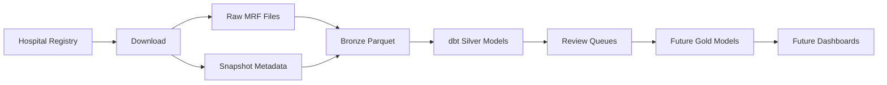

# Hospital Price Transparency

Hospital Price Transparency is a local-first data pipeline for working with CMS
hospital machine-readable files (MRFs). It downloads hospital source files,
tracks file snapshots, parses JSON and CSV layouts into source-faithful Bronze
Parquet, and models the data with dbt and DuckDB.

The project is built for research and engineering work on hospital price
transparency data. It emphasizes reproducible snapshots, source lineage, and a
clear separation between structural parsing in Python and semantic modeling in
dbt.

## Project Status

This is an active data engineering project with a working local ingestion and
modeling pipeline. The Python downloader, snapshot tracker, Bronze parsers, dbt
staging models, Silver foundation models, Silver payer normalization models, and
review queues are implemented.

Gold analytics models, dashboards, orchestration, Docker, and Terraform are not
production-ready in this repository yet.

## Why This Project Matters

Hospital price transparency data is public, valuable, and difficult to use in
practice. Hospitals publish large files in multiple layouts, with inconsistent
headers, nested payer contracts, changing URLs, mixed code systems, and
publisher-specific data quality issues.

This project addresses those problems as a reproducible healthcare analytics
pipeline: it captures source snapshots, preserves lineage, parses multiple MRF
formats, quarantines invalid records, applies quality checks, and builds
analytics-ready Silver models for downstream analysis.

## Current Implementation

The current implementation includes:

- Registry-driven downloads for a curated set of hospital MRF URLs.
- SHA-256 source-file change detection and Type-2 snapshot metadata.
- `fsspec`-backed raw storage, so local files and cloud object stores use the
  same storage abstraction.
- JSON, CSV Tall, and CSV Wide MRF parsing into Bronze Parquet.
- Quarantine output for records that fail parser validation.
- dbt/DuckDB staging views over Bronze Parquet.
- Silver Base models for hospitals, snapshots, locations, NPIs, contract
  provisions, charge items, codes, drug information, standard charges, payer
  rates, modifiers, and modifier-payer information.
- Silver Core payer-rate models with payer alias and payer/plan context matching.
- Incremental dbt materialization for snapshot-grained Silver and validation
  tables, with configurable current-only or all-snapshot retention.
- Review queue models for unmatched payer and payer/plan candidates.
- pytest coverage for configuration, registry validation, download, storage,
  snapshots, parser behavior, Parquet writing, and ingest orchestration.
- Append-only Parquet run audits for download, ingest, and dbt invocations.
- dbt schema and data tests for Bronze sources, staging, Silver, reconciliation,
  and payer normalization rules.
- Grain-aware validation rejection: file/header findings are report-only, while
  entity failures remove only the failing entity and its descendants.

## Repository Map

```text
src/hpt/             Python package and CLI
tests/               pytest suite
transform/           dbt project targeting DuckDB
docs/                Architecture, domain, and development docs
scripts/             Reusable utility scripts
infra/               Placeholder deployment infrastructure
orchestration/       Placeholder Airflow structure
data/                Local runtime output, ignored by git
logs/                Local run logs, ignored by git
```

## Quickstart

Use Python 3.11 or newer and DuckDB 1.5.2 or newer for dbt/DuckDB work.

```bash
python -m venv .venv
source .venv/bin/activate
pip install -e ".[dev,warehouse]"
duckdb --version
```

DuckDB 1.5.2 includes fixes required to checkpoint the project's dynamic
`UNPIVOT` staging views. Do not keep an older DuckDB CLI or UI connected to
`data/hpt.duckdb` while dbt is writing to it.

Verify the Python project:

```bash
make test
make lint
hpt --help
```

Download source MRFs from the bundled registry:

```bash
hpt download
```

Parse the current downloaded snapshots into Bronze Parquet:

```bash
hpt ingest
```

Build the DuckDB warehouse with dbt:

```bash
make export-hospitals-seed
make dbt-seed
make dbt-rebuild
make dbt-incremental HOSPITAL_IDS=ballad-jcmc
make dbt-test
```

By default, raw files, snapshot metadata, Bronze Parquet, quarantine records,
DuckDB files, and logs are written under local ignored paths.

## Common Commands

```bash
# Install
make install-dev

# Python quality checks
make test
make lint
make format

# Pipeline shortcuts
make download
make ingest

# Equivalent CLI commands and option help
hpt download
hpt ingest
hpt download --help
hpt ingest --help
hpt export-hospitals-seed --help
hpt clear-snapshot --help
hpt show-run --run-id <run-uuid>

# dbt
make dbt-seed
make dbt-run HOSPITAL_IDS=ballad-jcmc
make dbt-test
make dbt-unit-test
make dbt-build HOSPITAL_IDS=ballad-jcmc
make dbt-rebuild
make dbt-incremental HOSPITAL_IDS=ballad-jcmc
make dbt-build-selector HOSPITAL_IDS=ballad-jcmc DBT_SELECTOR=silver
make dbt-build-selector HOSPITAL_IDS=ballad-jcmc DBT_SELECTOR=pipeline_charge_data
```

The dbt project defines selectors for `staging`, `silver_base`, `silver_core`,
`silver_review_queue`, `silver`, `pipeline_snapshot_metadata`, and
`pipeline_charge_data`, plus the operational `audit`, `audit_staging`, and
`audit_marts` selectors.

`hpt run-dbt` defaults to the complete dbt graph so snapshot-grained
consumers, Silver tables, and cross-model tests stay coherent. Pass `--selector`
only for an intentionally partial run. Per-snapshot runs, including
`--full-refresh`, accept partial selectors.

Snapshot-grained incremental models use the custom `snapshot_replace` strategy.
It deletes rows for the explicitly requested `snapshot_ids` before inserting
the new model result, so a successful rebuild that produces zero rows still
removes the snapshot's prior rows. Repeat incremental runs require a non-empty
snapshot scope; use `hpt run-dbt` or the scoped Make targets above. Use
`make dbt-rebuild` for an unscoped full refresh.

When a build fails partway it can leave a snapshot partially materialized across
the Silver and validation tables. `hpt clear-snapshot --snapshot-ids <id>`
deletes that snapshot's rows from every snapshot-grained table so it is no longer
partial; raw files, snapshot metadata, and Bronze partitions are untouched, so
re-running dbt for the snapshot rebuilds it cleanly. Pass
`hpt run-dbt --clear-on-failure` to do this automatically when a build/run fails:
per-snapshot runs clear the failing snapshot, scoped runs clear the whole scoped
set. Canonical staging views remain unscoped and are intentionally not changed
by `clear-snapshot`.

## Runtime Configuration

Most local runs work with defaults. The main overrides are:

| Variable | Purpose | Default |
|---|---|---|
| `HPT_RAW_STORAGE_BASE_URI` | Raw downloads and snapshot metadata root | `file://.../data` |
| `HPT_BRONZE_ROOT` | Parsed Bronze Parquet root | `data/bronze` |
| `HPT_QUARANTINE_ROOT` | Parser validation failures | `data/quarantine` |
| `HPT_AUDIT_ROOT` | Queryable command run and attempt audits | `data/audit` |
| `HPT_REGISTRY_PATH` | Optional hospital registry override | bundled registry |
| `HPT_DUCKDB_PATH` | dbt DuckDB database path | `data/hpt.duckdb` |
| `HPT_SILVER_RETENTION_MODE` | Silver/validation retention, `current_only` or `all_snapshots` | `current_only` |

See `docs/configuration.md` for all environment variables, precedence rules, and
HTTP client settings.

## Architecture

The pipeline follows a medallion pattern:



Python owns:

- hospital registry loading;
- HTTP download and retry behavior;
- raw file and snapshot metadata storage;
- compression handling and MRF layout sniffing;
- JSON and CSV structural parsing;
- Bronze Parquet writing and quarantine output.

dbt owns:

- external Bronze source definitions for DuckDB;
- external audit source definitions and operational audit views;
- staging views over Bronze;
- Silver Base normalization across JSON and CSV inputs;
- Silver Core payer identity and payer/plan context enrichment;
- review queues and data quality tests.

Bronze intentionally preserves source values and lineage. Business
normalization, payer matching, code interpretation, and analytics-friendly
shaping belong in dbt models.

## Data And Lineage

Downloaded MRFs can be large and are not committed to git. Runtime output is
local by default and ignored:

- `data/raw/` for source files;
- `data/metadata/` for snapshot metadata;
- `data/bronze/` for parsed Parquet;
- `data/quarantine/` for validation failures;
- `data/audit/` for append-only invocation and attempt audit Parquet;
- `data/hpt.duckdb` for local dbt/DuckDB work;
- `logs/` for CLI run logs and failure summaries.

Snapshot lineage is a core design constraint. Downstream tables preserve
identifiers such as `snapshot_id`, `file_hash`, source URL, source filename, and
ingest timestamps so modeled rows can be traced back to the source file.

Each `hpt download`, `hpt ingest`, and `hpt run-dbt` invocation receives a
unique `run_id`. Inspect a run with `hpt show-run --run-id <run-uuid>`.
Separate command invocations can be correlated through their shared
`snapshot_id`.

## Example Use Case

One intended workflow is comparing negotiated payer rates across hospitals after
normalizing charge items, payer identities, and plan context. The pipeline keeps
the source file lineage intact while converting heterogeneous JSON and CSV MRFs
into dbt models that can support cross-hospital rate analysis.

## Documentation

Start with:

- `docs/architecture/pipeline-overview.md`
- `docs/architecture/medallion-layers.md`
- `docs/architecture/storage-layout.md`
- `docs/architecture/bronze-schema.md`
- `docs/architecture/silver-schema.md`
- `docs/architecture/external-data-enrichment.md`
- `docs/domain/hpt-glossary.md`
- `docs/domain/cms-mrf-schema-notes.md`
- `docs/domain/hospital-registry-rules.md`
- `docs/development/getting-started.md`
- `docs/development/testing-strategy.md`

`docs/notes/` and `docs/planning/` are planning history, not authoritative
runtime documentation.

## Current Limitations

- The bundled registry is curated for development and research coverage, not a
  complete national hospital registry.
- Publisher MRF URLs can change or disappear; failed downloads should be
  investigated against the registry and source hospital pages.
- Gold analytics models are planned but not implemented.
- Airflow, Docker, and Terraform directories are placeholders.
- This project is not medical, billing, legal, or compliance advice.

## License

This project is licensed under the [Apache License 2.0](LICENSE.md).
