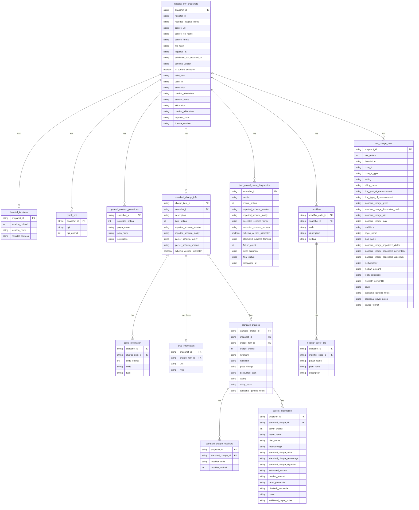

# Bronze Schema Diagram

This document describes the implemented Bronze schema. It is grounded in
`src/hpt/parsers/schemas.py`, `docs/bronze_layer.md`, and the current dbt Bronze
source declarations in `transform/models/staging/_bronze_sources.yml`.

Local reference image:

The image is a useful visual reference, but the Mermaid diagram below reflects
what currently exists in the parser schemas. Bronze does not currently include a
canonical `hospital` dimension, and most leaf tables do not have Silver-style
surrogate primary keys.

## Current Table Families

Shared tables for all formats:

- `hospital_mrf_snapshots`
- `hospital_locations`
- `type2_npi`
- `general_contract_provisions` (JSON emits one row per array object with
  optional payer/plan; CSV emits a single row from the flat General Data
  Element column)

JSON-only tables:

- `standard_charge_info`
- `code_information`
- `drug_information`
- `standard_charges`
- `standard_charge_modifiers`
- `payers_information`
- `json_record_parse_diagnostics`
- `modifiers`
- `modifier_payer_info`

CSV Bronze table:

- `csv_charge_rows`

## Important Notes

- Optional tables a parser emits with no rows for a snapshot (e.g.
  `general_contract_provisions` when absent, or `modifiers` for a file with no
  modifier dimension) are written as zero-row Parquet files so their partition
  directory always exists and downstream dbt `read_parquet` globs do not fail.
- `general_contract_provisions` is source-faithful: a provisions object missing
  its required `provisions` text is preserved (not quarantined), and the dbt
  `general_contract_provisions_required_shape` rule flags it in
  `val__header_violations`.
- `code_N` and `code_N_type` columns in `csv_charge_rows` are dynamic per file.
- Bronze stores `modifier_code` strings on `standard_charge_modifiers`; it does
  not resolve them to `modifier_code_id`.
- JSON `standard_charge_information` rows include reported and parser schema
  family fields. When a row parses only under a non-reported schema family, the
  row is retained and `json_record_parse_diagnostics` records the fallback.
- Both JSON and CSV Bronze store numeric-looking source values (charges,
  percentiles, units) as raw text (`Utf8`). dbt staging is the numeric type
  boundary: it casts currency-like amount fields to `decimal(18, 4)` via
  `hpt_safe_decimal` and percentages/units to `double` via `hpt_safe_double`
  before Silver modeling; see `docs/decisions/0010-monetary-precision.md`.
- JSON and CSV differ in how invalid numbers are surfaced. JSON validates each
  record with Pydantic before Bronze, so a record with an invalid numeric field
  is quarantined as JSONL and recorded in the `json_record_parse_diagnostics`
  Bronze table — invalid JSON numbers generally never reach an accepted Bronze
  row. CSV performs no such validation; its malformed numeric values survive as
  raw text in Bronze and are queryable through the dbt
  `stg_bronze__csv_numeric_parse_diagnostics` staging model, which emits one row
  per non-empty raw value that fails the staging cast. The broader dbt
  validation schema now supersedes that CSV-only diagnostic for Silver
  filtering: `val__standard_charge_violations`, `val__payer_rate_violations`,
  and `val__drug_violations` emit one row per malformed numeric value across
  JSON and CSV where Bronze row evidence exists.
- Bronze preserves source values and parser lineage. Hospital, payer, plan,
  charge-item, code, and modifier normalization belongs in Silver.
- Bronze and staging are not filtered by validation. Reject-severity validation
  failures remain in Bronze and are excluded only when Silver base models
  anti-join the dbt rejection keysets.
