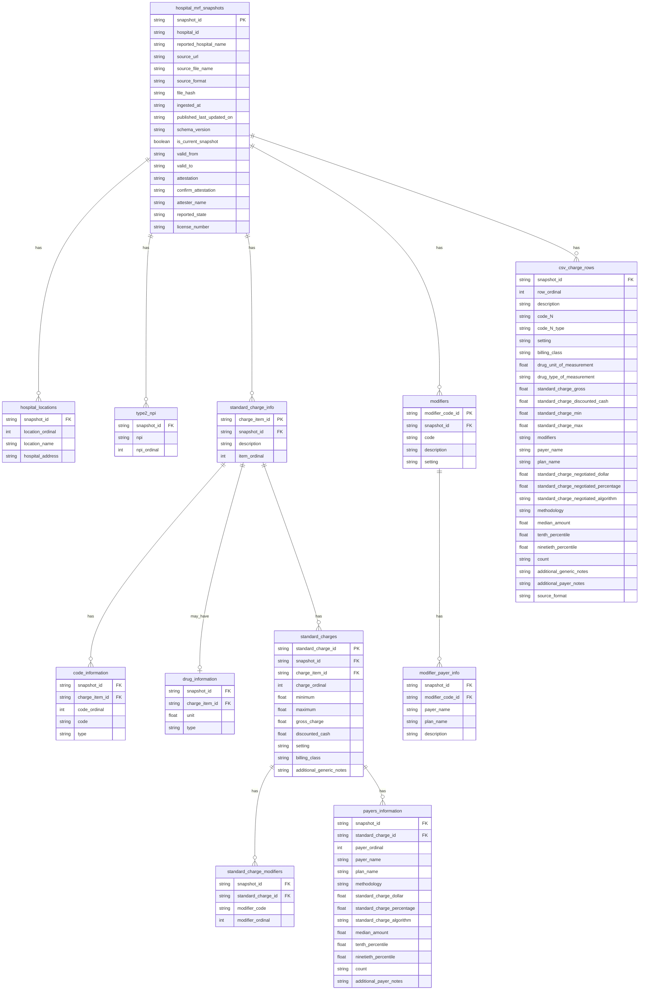

# Bronze Schema Diagram

This document describes the implemented Bronze schema. It is grounded in
`src/hpt/parsers/schemas.py`, `docs/bronze_layer.md`, and the current dbt Bronze
source declarations in `transform/models/staging/_bronze_sources.yml`.

Local reference image:

The image is a useful visual reference, but the Mermaid diagram below reflects
what currently exists in the parser schemas. Bronze does not currently include a
canonical `hospital` dimension, and most leaf tables do not have Silver-style
surrogate primary keys.

## Current Table Families

Shared tables for all formats:

- `hospital_mrf_snapshots`
- `hospital_locations`
- `type2_npi`

JSON-only tables:

- `standard_charge_info`
- `code_information`
- `drug_information`
- `standard_charges`
- `standard_charge_modifiers`
- `payers_information`
- `modifiers`
- `modifier_payer_info`

CSV Bronze table:

- `csv_charge_rows`

## Important Notes

- `csv_charge_rows` is produced by CSV parsers, but it is not yet declared in
  `transform/models/staging/_bronze_sources.yml`.
- `code_N` and `code_N_type` columns in `csv_charge_rows` are dynamic per file.
- Bronze stores `modifier_code` strings on `standard_charge_modifiers`; it does
  not resolve them to `modifier_code_id`.
- Bronze preserves source values and parser lineage. Hospital, payer, plan,
  charge-item, code, and modifier normalization belongs in Silver.
