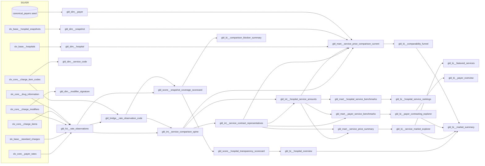

# Gold Schema — dbt Pipeline Reference

Status: implemented (Phase 1 + Phase 2 marts), 2026-06-26.

Gold is the analytics-ready medallion layer. It consumes **only Silver** (never
Bronze) and applies Kimball dimensional modeling: an atomic fact at the smallest
grain, conformed dimensions, a bridge for the multi-code many-to-many, and
aggregate marts/scorecards built *from* the fact — never blended into it.

The comparability rules come from decision
[0017](../decisions/0017-gold-comparability-framework.md); the atomic-fact +
bridge split is decision
[0018](../decisions/0018-gold-fact-is-atomic-code-expansion-is-a-bridge.md);
methodology-separated, hospital-weighted market statistics are decision
[0021](../decisions/0021-methodology-separated-hospital-weighted-market-statistics.md).

All Gold models land in the `main_gold` DuckDB schema.

## Pipeline DAG



## Materialization & run scoping

| Model(s) | Materialization | Strategy | Reads inputs | Tag |
|---|---|---|---|---|
| `gld_dim__*` (5) | `table` | full refresh | **unscoped** `ref()` | `gold_dimension` |
| `gld_fct__rate_observations`, `gld_bridge__rate_observation_code` | `incremental` | `snapshot_replace` on `snapshot_id` | `hpt_scoped_ref()` | `gold_per_snapshot` |
| `gld_int__service_comparison_spine`, `gld__*` marts | `table` | full refresh | `ref()` | `gold_marts` |
| `gld__*` scorecards | `table` | full refresh | `ref()` | `gold_scorecards` |
| `gld_bi__*` presentation marts | `table` | full refresh | `ref()` | `gold_bi` |

The per-snapshot workflow (`hpt run-dbt --per-snapshot`) runs five ordered Gold
passes: `gold_dimension` (unscoped, once) → `gold_per_snapshot` (scoped fact +
bridge) → `gold_marts` (unscoped, once) → `gold_scorecards` (unscoped, once) →
`gold_bi` (unscoped, once).
Selectors: `gold_core`, `gold_dimension`, `gold_per_snapshot`, `gold_marts`,
`gold_scorecards`, `gold_bi`, and `gold` (everything).

## Conformed dimensions

### `gld_dim__hospital`
Grain: one row per `hospital_id` (registry-backed, SCD type 1).
`hospital_id` (PK), `canonical_hospital_name`, `clean_canonical_hospital_name`,
`canonical_state`, `canonical_state_name`, `canonical_state_type`,
`canonical_census_region`, `canonical_census_division`, `hospital_type`,
`health_system`, `expected_format`, `mrf_url`.

### `gld_dim__snapshot`
Grain: one row per `snapshot_id`. `snapshot_id` (PK), `hospital_id` (FK),
`source_format`, `is_current_snapshot`, `valid_from`, `valid_to`,
`published_last_updated_on`, `ingested_at`, `schema_version`, `source_url`,
`source_file_name`, `file_hash`, `snapshot_age_days`, `freshness_bucket`. In v1
this dimension also carries the date attributes a `gld_dim__date` would own.

### `gld_dim__payer`
Grain: one row per `canonical_payer_id`, plus one explicit `<unmatched>` sentinel.
`canonical_payer_id` (PK), `canonical_payer_name`, `payer_parent_id`,
`payer_parent_name`, `payer_type`, `is_unmatched_member`. Only stable payer
attributes; observation-level context (`market_segment`, `benefit_line`,
`plan_type`) stays on the fact.

### `gld_dim__service_code`
Grain: one row per `(canonical_code_system, match_code)` among
cross-hospital-comparable codes. `service_code_key` (PK = `md5(system||code)`),
`canonical_code_system`, `match_code`, `code_is_specific`,
`code_cross_hospital_comparable`. This is the realized enrichment seam (decision
0019): green-light, public-domain descriptions and grouper context join from
`slv_core__billing_code_descriptions` — `code_description`,
`code_description_edition`, `code_description_source`, `code_description_license`,
`relative_weight`, `ms_drg_mdc`, `ms_drg_type`, and `has_code_description`. MS-DRG
is loaded today (HCPCS/APC next); licensed systems (CPT/CDT) stay
`code_description`-null with a license marker. The conformed dimension carries the
latest loaded edition's description per code (a v1 simplification; per-snapshot
as-of joins are the future step).

### `gld_dim__modifier_signature`
Grain: one row per `modifier_signature` (a distinct *set* of modifier codes),
plus a no-modifier sentinel. `modifier_signature` (PK), `modifier_count`,
`modifier_codes`, `modifier_label`, `modifier_meanings`,
`has_pro_tech_split_modifier`, `has_unreferenced_modifier`,
`is_no_modifier_member`. Decodes the opaque signature on the fact for BI without
widening the fact or risking a modifier double-count.

## Core: atomic fact + bridge

### `gld_fct__rate_observations` (atomic fact)
Grain: **one row per `(source charge/rate row, amount_kind)`** within one
snapshot. Does **not** fan out on billing code. A standard charge contributes up
to four observation rows (gross/cash/min/max); a payer rate up to seven
(dollar/percentage/algorithm/estimated/median/p10/p90). `is_price_rankable`
gates the ranking subset (only `gross_charge`, `discounted_cash`, and
`comparable_dollar` `negotiated_dollar`). Carries lineage, amount semantics,
degenerate comparison context (`clean_setting`, `clean_billing_class`,
`modifier_signature`), payer identity/context, drug context, and currentness.
PK `gold_rate_observation_id`. See decision 0018.

### `gld_bridge__rate_observation_code` (bridge)
Grain: one row per `(gold_rate_observation_id, silver_charge_item_code_id)`.
Joins the fact to `slv_core__charge_item_codes`. `service_code_key` is populated
only for cross-hospital-comparable codes with a non-null `match_code` (the
`gld_dim__service_code` membership) and null otherwise. Exposes — never filters —
the comparability flags, so the coverage scorecard can count non-comparable codes
and the mart can apply the gate.

## Marts (aggregates)

### `gld_int__service_comparison_spine` (intermediate)
Materializes the code-expanded, classified spine (`fact ⋈ bridge` + the §6
`comparison_tier` / blocker columns) once, current snapshots only, so the
downstream references read it back instead of rebuilding it (memory). Adds the
decision 0021 identity columns: `comparison_methodology` (`methodology` for
negotiated dollars, `'not applicable'` otherwise) and `service_context_key`
(md5 of the exact comparison context: code cohort + setting + billing class +
modifier signature + amount kind + comparison methodology + drug unit context).
Grain: `(gold_rate_observation_id, service_code_key)`.

### `gld_int__service_contract_representatives` (intermediate)
Decision 0021 level 1: one row per `(hospital_id, snapshot_id,
service_context_key, source_contract_key)` over the negotiated-dollar ranking
subset. Collapses exact repetitions of one amount inside a contract/context to
one `contract_representative_amount`; a contract/context with multiple distinct
amounts is flagged `has_multiple_contract_amounts` and gets no representative
(visible, excluded, never averaged).

### `gld_int__hospital_service_amounts` (intermediate)
Decision 0021 level 2: one row per `(hospital_id, service_context_key)` — each
hospital's ONE vote per exact context. Negotiated: median of valid contract
representatives (null when every contract is ambiguous). Gross/cash: median of
ranking rows. Every market percentile/median/rank/delta downstream is computed
over `hospital_amount` from this model, so the marts reconcile by construction.

### `gld_mart__service_price_comparison_current`
User question: which hospitals report comparable current prices, how do they
vary, how much to trust them. Grain: `(gold_rate_observation_id,
service_code_key)`, current only. All tiers retained with `comparison_tier`,
the twelve blocker flags (including the contract-grain
`multiple_amounts_per_contract_context`), and a `blocker_reasons` array.
Market-wide **and** payer-specific peer cuts (median/p10/p90/pct-rank/deltas)
are hospital-weighted from the representative intermediates and gated by the
3-valid-hospital floor; every ranked row of one hospital/context shares the
hospital's rank. Guarded `gross_to_cash_ratio` / `cash_to_negotiated_ratio`.
Dimension attributes joined for hospital, snapshot, and payer.

### `gld_mart__service_price_summary`
Grain: one row per exact comparison context — `(service_code_key,
clean_setting, clean_billing_class, modifier_signature, amount_kind,
comparison_methodology, canonical_drug_unit_type)`, equivalently
`service_context_key`. All distribution statistics are hospital-weighted over
`gld_int__hospital_service_amounts`. Publishes the three-way denominator
(`reporting_hospital_count` / `hospital_count` / `excluded_hospital_count`)
plus observation/contract/payer counts; percentiles/IQR/spread/outliers
suppressed below the 3-valid-hospital floor. Robust 1.5×IQR outlier flag over
hospital representatives (`outlier_hospital_count`, no winsorizing).

### `gld_mart__hospital_service_benchmarks`
Grain: `(hospital_id, service_context_key)`. The hospital's representative
amount (from the shared intermediate) vs hospital-weighted market stats for
four peer groups — all, same state, same `hospital_type`, same `health_system`
— each methodology-separated and gated by its own 3-hospital floor.

### `gld_mart__payer_service_benchmarks`
Grain: `(canonical_payer_id, hospital_id, service_context_key)`,
`amount_kind = negotiated_dollar`. Payer identity is the prerequisite gate
(unmatched never enters). Built from contract representatives: one
payer-hospital representative per exact context, one hospital-weighted payer
market over them. `cash_comparison_status` guards methodology compatibility —
per-diem daily rates are never labeled above/below cash; ambiguous contexts
stay visible with null statistics. Plus `payer_match_coverage_rate`.

## Scorecards (trust / data quality)

### `gld_score__snapshot_coverage_scorecard`
Grain: one row per `snapshot_id`. Atomic record/observation/amount-kind counts
from the fact (reconcile by construction), comparable-code counts, coverage
rates, comparison-tier counts, and the ten row-level blocker counts re-derived
from `fact ⋈ bridge` via the §6 macros. Ranks trust before price.

### `gld_score__hospital_transparency_scorecard`
Grain: one row per `hospital_id` (current snapshot). Rolls the coverage
scorecard up to 0–1 readiness scores: `freshness_score`, `code_coverage_score`,
`amount_coverage_score`, `payer_mapping_score`, `comparison_readiness_score`, and
an `overall_readiness_score` composite. **Coverage / readiness, not legal
compliance.**

## BI presentation marts

These are wide, dashboard-ready surfaces. They do not redefine comparability,
denominator floors, payer matching, or trust logic; they join labels and derive
display bands from the Gold facts, marts, scorecards, and dimensions.

Presentation helpers recur across these marts (macros in
`transform/macros/bi_presentation.sql`): `service_url_slug`, a URL-safe service
identifier 1:1 with `service_code_key` (singular test
`gld_bi_service_slug_one_to_one.sql`); `service_context_url_slug`, a URL-safe
exact-context identifier 1:1 with `service_context_key` (singular test
`gld_bi_context_slug_one_to_one.sql`); `comparison_methodology_display_label`
(spells out the payment unit, e.g. 'Per diem (per day)'); and
`description_availability` (`available` / `license_restricted` / `not_loaded`),
which explains why a code description is or is not displayable. The former shared `trust_band` name was
split into two deliberately distinct measures: hospital-level
`data_confidence_band` (readiness-score derived) and context-level
`comparison_confidence_band` (cohort size + description availability), both
with values `high`/`moderate`/`limited`/`low`.

### `gld_bi__hospital_overview`
Grain: one row per `hospital_id` / current scored snapshot. Joins hospital
display fields, current snapshot freshness, readiness scores, coverage rates,
rank fields, benchmark/context counts, and `data_confidence_band`. Default
source for hospital overview cards, maps, and ranked tables.

### `gld_bi__service_market_explorer`
Grain: one row per exact comparison context (`service_context_key`; includes
`comparison_methodology` and drug unit context). Adds service display
code/name/label, `service_url_slug`, `service_context_url_slug` (the durable
exact-context link target, 1:1 locked by
`gld_bi_context_slug_one_to_one.sql`), methodology display label,
`description_availability`, modifier label, the three-way hospital
denominator, threshold flags, spread measures, `comparison_status`,
`comparison_confidence_band`, and `variation_band` over
`gld_mart__service_price_summary`.

### `gld_bi__hospital_service_rankings`
Grain: `(hospital_id, service_context_key)`. Enriches
`gld_mart__hospital_service_benchmarks` with hospital and service labels,
methodology labels, `service_context_url_slug`, plus all-market
`price_position_band`, `is_high_outlier`, and `is_low_outlier`.

### `gld_bi__payer_contracting_explorer`
Grain: `(canonical_payer_id, hospital_id, service_context_key)`. Enriches
`gld_mart__payer_service_benchmarks` with payer/hospital/service labels,
methodology labels, `service_context_url_slug`, `cash_comparison_status`,
`contract_position_band`, and `cash_comparison_band` (which carries
`per_diem_incompatible` / `ambiguous_negotiated_context` instead of a
direction where the comparison is not methodology-compatible).

### `gld_bi__comparison_blocker_summary`
Grain: `(snapshot_id, blocker_code)`. Unpivots the snapshot coverage scorecard's
blocker counts into BI-friendly rows with blocker labels/categories and blocked
row shares.

### `gld_bi__featured_services`
Grain: one selected service/context/amount kind. Rule-selected from
`gld_bi__service_market_explorer`, capped at 30 rows, and intended only as a
default shortlist for public reports and dashboard demos.

### `gld_bi__market_summary`
Grain: exactly one row (`summary_id = 'current_corpus'`). Corpus headline KPIs
with distinct-count semantics (hospitals, comparable services, matched payers,
funnel totals/shares) so dashboards never sum per-hospital counts and
double-count shared services or payers.

### `gld_bi__comparability_funnel`
Grain: `(scope_level, hospital_id, stage_index)`; `scope_level` is `hospital`
or `corpus` (with the `<corpus>` hospital sentinel). Five cumulative
decision-0017 gates over `gld_mart__service_price_comparison_current`
classified rows: published → code-comparable → context-aligned → rankable
dollar → meets the 3-hospital floor. Monotonicity locked by
`gld_bi_funnel_stage_monotonic.sql`; stage 5 is the cohort-grain
`below_min_hospital_denominator` gate.

### `gld_bi__payer_overview`
Grain: one row per `canonical_payer_id` from the contracting explorer.
Distinct-count aggregates (hospitals, services, contexts), contract-position
band counts, and cash-comparison band counts including `share_above_cash`.

## Entity relationship overview

```text
gld_dim__hospital   1───* gld_dim__snapshot
gld_dim__hospital   1───* gld_fct__rate_observations
gld_dim__snapshot   1───* gld_fct__rate_observations
gld_dim__payer      1───* gld_fct__rate_observations   (canonical_payer_id; '<unmatched>' sentinel)
gld_dim__modifier_signature 1───* gld_fct__rate_observations  (modifier_signature)
gld_fct__rate_observations 1───* gld_bridge__rate_observation_code
gld_dim__service_code 1───* gld_bridge__rate_observation_code  (service_code_key; null for non-comparable)

gld_fct__rate_observations + gld_bridge ──> gld_int__service_comparison_spine
gld_int__service_comparison_spine ──> gld_int__service_contract_representatives ──> gld_int__hospital_service_amounts
gld_int__service_comparison_spine + representatives ──> gld_mart__service_price_comparison_current
gld_int__hospital_service_amounts ──> gld_mart__service_price_summary
gld_int__hospital_service_amounts ──> gld_mart__hospital_service_benchmarks
gld_int__service_contract_representatives + gld_int__hospital_service_amounts ──> gld_mart__payer_service_benchmarks
gld_fct__rate_observations + gld_bridge ──> gld_score__snapshot_coverage_scorecard ──> gld_score__hospital_transparency_scorecard
gld__* marts + gld__* scorecards + dimensions ──> gld_bi__* presentation marts
```

## Testing

Grain assertions via `dbt_utils.unique_combination_of_columns`; PK
`unique`+`not_null`; relationships from the fact/bridge/marts back to the
dimensions and Silver lineage; accepted-values locks on `amount_kind`,
`amount_role`, `amount_unit`, `observation_scope`, `comparison_tier`, and the
blocker enums; semantic-guard singular tests in `transform/tests/gld_*`
(no non-dollar in price ranking, no stale current rows, denominator floors,
no division-by-zero, payer gate, scores in range, BI band/rate guards); and
reconciliation tests (coverage scorecard → fact, summary → mart).
