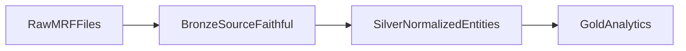

# Medallion Layers

The project follows a medallion pattern: Bronze preserves source-faithful parsed
records, Silver normalizes business entities, and Gold serves analytics.

## Bronze

Status: implemented for JSON, CSV Tall, and CSV Wide parser outputs.

Bronze is a structural representation of source MRFs. It should preserve raw CMS
values and avoid business-level normalization.

Bronze responsibilities:

- Track one `hospital_mrf_snapshots` row per ingested file.
- Preserve source URL, source filename, file hash, snapshot ID, and ingest
  metadata.
- Parse common header fields into `hospital_mrf_snapshots`,
  `hospital_locations`, and `type2_npi`.
- Stream JSON `standard_charge_information` into relational tables that mirror
  the JSON hierarchy.
- Parse CSV Tall charge rows into `csv_charge_rows`.
- Unpivot CSV Wide payer columns into the same `csv_charge_rows` shape.
- Quarantine rows that fail parser validation.

Bronze should not:

- Resolve hospital identity across source files.
- Canonicalize payer or plan names.
- Group CSV rows into charge-item entities.
- Explode code columns into normalized code dimensions.
- Resolve modifier strings to modifier definitions.
- Cast questionable source values into stricter business types when doing so
  would lose source fidelity.

See `docs/bronze_layer.md` for the Bronze data dictionary.
See `docs/architecture/bronze-schema.md` for the implemented Bronze schema
diagram.

## Silver

Status: planned. The dbt project has a `models/silver/` directory, but no
implemented models yet.

Silver will convert source-faithful Bronze data into normalized analytical
entities.

Expected responsibilities:

- Normalize hospital identity from registry and source metadata.
- Normalize charge items across JSON and CSV inputs.
- Split and type billing codes from JSON and CSV sources.
- Standardize payer and plan strings where rules are defensible.
- Normalize modifiers and modifier relationships.
- Convert source date strings into typed dates where valid.
- Apply data quality tests for expected keys, grains, and accepted values.

Silver should remain close enough to source data that issues can be traced back
to a specific `snapshot_id`, source file, and row or ordinal.

See `docs/architecture/silver-schema.md` for the target Silver schema diagram.

## Gold

Status: planned. The dbt project has a `models/gold/` directory, but no
implemented models yet.

Gold will serve use-case-specific analytics.

Likely responsibilities:

- Hospital-level price comparison views.
- Payer and plan comparison tables.
- Charge-code and service-line summaries.
- Compliance and data-completeness reporting.
- Datasets suitable for dashboards or notebooks.

Gold models can trade some source detail for usability, but they should retain
lineage back to Silver and Bronze identifiers.

## Layer Ownership

- Python owns raw acquisition and Bronze structural parsing.
- dbt owns Silver and Gold SQL transformations.
- DuckDB is the expected local analytical database.
- Airflow, Docker, and Terraform will orchestrate and deploy this flow later.
