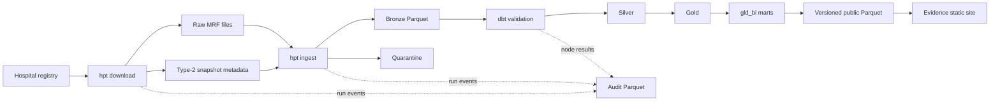

# Architecture Overview

Hospital Price Transparency is a local-first pipeline for acquiring CMS hospital
machine-readable files, preserving their source lineage, normalizing their
semantics, and publishing bounded cross-hospital analysis.

## System Flow

The pipeline has four execution phases:

| Phase | Entry point | Result |
|---|---|---|
| Acquire | `hpt download` | Raw source file, SHA-256 hash, and snapshot metadata |
| Parse | `hpt ingest` | Source-faithful Bronze Parquet plus quarantine records |
| Model | `hpt run-dbt` | Validation, Silver, Gold, BI, and audit models in DuckDB |
| Publish | `scripts/export_evidence_artifact.py` and the Evidence build | Allowlisted Parquet artifacts and a static reporting site |

## Component Ownership

### Python ingestion

Python owns operations that depend on source-file structure:

- registry loading and source URL selection;
- streaming HTTP, retries, hashing, and raw storage;
- Type-2 snapshot metadata;
- compression handling and layout detection;
- streaming JSON, CSV Tall, and CSV Wide parsing;
- Bronze Parquet and quarantine writing; and
- append-only command and attempt audit events.

The CLI remains a thin process boundary. `src/hpt/ingest/` owns acquisition and
storage, `src/hpt/parsers/` owns structural parsing, `src/hpt/loaders/` owns
Bronze output, and `src/hpt/pipeline/` sequences those components.

### dbt and DuckDB

dbt owns semantics that should be testable and visible in SQL:

- external Bronze and audit sources;
- source-grain staging views;
- CMS validation violations and rejection keysets;
- Silver entity normalization and payer/plan enrichment;
- conformed Gold dimensions, the atomic rate fact, and code bridge;
- comparison, benchmark, coverage, and readiness marts; and
- wide `gld_bi__*` presentation tables.

All dbt execution goes through `hpt run-dbt`, which resolves snapshot scope,
prepares source sentinels, applies memory-bounding run modes, and records audit
metadata.

### Public reporting

Evidence reads only exported Parquet from the allowlisted `gld_bi__*` marts plus
generated metadata and a public data dictionary. It does not read Bronze,
Silver, validation tables, the atomic fact, or the working DuckDB database.

Comparability, denominator floors, payer matching, readiness scores, and amount
semantics therefore remain warehouse contracts. Evidence page SQL may filter,
sort, and label those outputs but may not redefine them.

## Layer Contracts

### Raw and snapshots

Raw files are immutable source artifacts. A download is hashed before a new
snapshot is written; unchanged bytes do not create duplicate snapshots.
Snapshot metadata carries the hospital, source URL, source filename, hash,
ingestion time, validity interval, and current-snapshot flag.

Raw storage and snapshot metadata use the same `fsspec` base URI, preserving the
option to use local or object storage without changing parser behavior.

### Bronze

Bronze is implemented for JSON, CSV Tall, and CSV Wide. It preserves CMS values
and hierarchy closely enough to trace every modeled record to a source snapshot
and source position.

Bronze may parse structure, unpivot wide payer columns, and split repeated header
fields. It must not resolve hospital identity, canonicalize payers, group service
items, roll up codes, or silently coerce questionable business values.

See the [Bronze schema](bronze-schema.md) and
[Bronze data dictionary](../bronze_layer.md).

### Validation

Validation is the queryable boundary between Bronze/staging and Silver. It emits
one row per failing value with a stable rule ID, severity, grain, source keys,
and CMS citation metadata.

Rejection keysets are grain-aware: file and header findings are report-only,
while entity failures remove only the failing entity and its descendants. Warn
severity alone does not determine exclusion.

See [CMS validation rules](../domain/cms-validation-rules.md).

### Silver

Silver Base normalizes source formats into common hospitals, snapshots,
locations, charge items, codes, standard-charge contexts, payer rates, modifiers,
and related entities. Silver Core adds canonical payer identity, payer/plan
context, billing-code enrichment, drug and modifier reference data, and
deterministic service-item identity.

Silver retains `snapshot_id` and source keys so transformations remain
explainable. Review queues expose uncertain payer and payer/plan matches rather
than silently forcing identity resolution.

See the [Silver schema](silver-schema.md) and [Silver Core](silver-core.md).

### Gold and BI

Gold provides five conformed dimensions, an atomic rate-observation fact, a
many-to-many code bridge, current comparison and benchmark marts, and coverage
and transparency scorecards. The fact remains additive because code expansion
occurs only through the bridge.

Cross-hospital comparison is code-cohort based, context-aligned, dollar-aware,
and explainable through blocker reasons. Cohorts below the three-hospital floor
publish no percentile ranking.

The nine `gld_bi__*` marts are the only public reporting contract. See the
[Gold schema](gold-schema.md), [BI layer](../development/bi-layer.md), and
[comparability decision](../decisions/0017-gold-comparability-framework.md).

### Operational audit

Audit data describes pipeline execution rather than hospital pricing, so it
remains outside the medallion flow. Append-only run, attempt, and dbt-node events
capture status, source lineage, stage timing, output counts, model timing, and
peak resident memory. dbt exposes them as views and operational marts in
`main_audit`.

Use `hpt show-run --run-id <run-uuid>` for a joined view of one invocation.

## Snapshot Scope And Retention

Canonical staging views remain unscoped over available Bronze data. Each
snapshot-grained consumer applies the requested `snapshot_ids` at its input
boundary.

Snapshot-grained validation, Silver, and Gold fact/bridge tables use the custom
`snapshot_replace` incremental strategy. It deletes rows for the explicit
snapshot scope before inserting the new result, including when the result is
empty, while preserving unrelated snapshots.

`HPT_SILVER_RETENTION_MODE` controls modeled history:

- `current_only` is the default product mode and prunes non-current modeled
  snapshots after successful materialization.
- `all_snapshots` retains accumulated Silver and validation history for
  longitudinal extensions.

Bronze always preserves parsed snapshots regardless of modeled retention.

## Full-Corpus Resource Strategy

The 14-hospital Nashville corpus is large enough that validation grain builds
can exceed a small machine's DuckDB spill budget. Supported memory-bounding
approaches are:

- hospital-batched scoped builds of approximately four hospitals; or
- the orchestrator's per-snapshot/full-refresh modes.

See [Snapshot-Scoped dbt Runs](../development/snapshot-scoped-runs.md) for exact
commands, recovery behavior, and retention interactions.

## Current Boundary

The Python ingestion pipeline, dbt validation/Silver/Gold layers, artifact
export, and Evidence reporting app are implemented. Airflow, containerization,
and Terraform remain planning targets and are not required by the local runtime.
