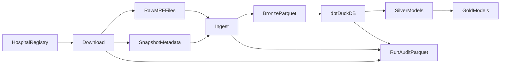
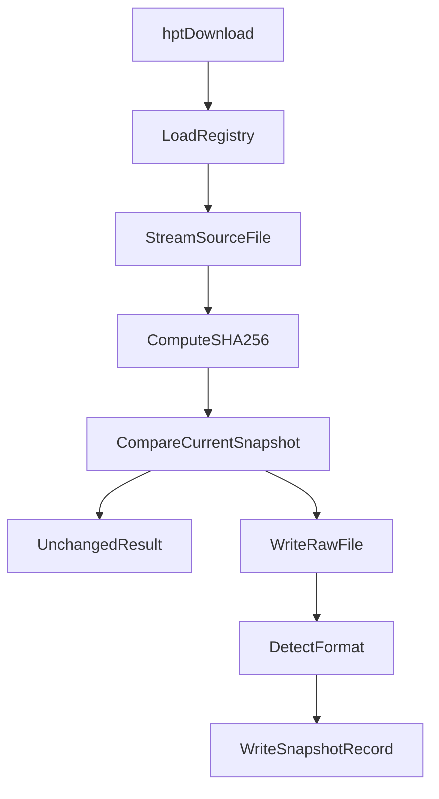
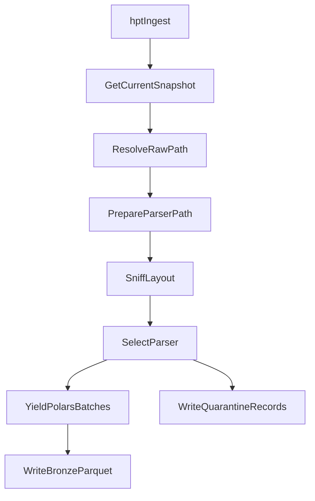

# Pipeline Overview

The implemented pipeline has two Python CLI phases followed by a dbt/DuckDB
modeling phase.

## Implemented Components

`hpt download` reads hospital sources from the active registry, streams each MRF
URL to temporary storage, hashes the bytes, compares the hash to the current
snapshot, and writes a new raw file plus Type-2 snapshot metadata only when the
source changed.

Important modules:

- `src/hpt/cli.py`
- `src/hpt/ingest/download.py`
- `src/hpt/ingest/client.py`
- `src/hpt/ingest/storage.py`
- `src/hpt/ingest/snapshot.py`
- `src/hpt/registry/loader.py`

`hpt ingest` resolves each hospital's current snapshot, materializes compressed
files when needed, sniffs the MRF layout, selects a parser, writes Bronze Parquet
batches, and sends validation failures to quarantine.

Important modules:

- `src/hpt/pipeline/ingest_snapshot.py`
- `src/hpt/ingest/mrf_sniffer.py`
- `src/hpt/ingest/compression.py`
- `src/hpt/parsers/json_mrf.py`
- `src/hpt/parsers/csv_tall.py`
- `src/hpt/parsers/csv_wide.py`
- `src/hpt/loaders/parquet.py`

`transform/` is the dbt project. It defines external Bronze Parquet sources for
DuckDB, staging views, validation models, Silver Base/Core models, review queue
models, and the implemented Gold dimensional/analytics layer. Snapshot-grained
Silver, validation, and Gold fact/bridge tables are incremental.

## Download Flow

Key behavior:

- The registry controls which hospitals and URLs are targeted.
- File hashes prevent duplicate snapshots when downloaded bytes are unchanged.
- Raw storage and snapshot metadata share the same `fsspec` base URI.
- The `--force` flag forces a download attempt, but hash comparison still
  determines whether a new snapshot is written.

## Ingest Flow

Key behavior:

- Ingest operates on current snapshot metadata, not directly on arbitrary files.
- Compressed raw archives remain intact; parser-ready copies are materialized
  under temporary storage when needed.
- Parser outputs are grouped by Bronze table name.
- `BronzeWriter` writes partitioned Parquet parts under the Bronze root.

## Transform Flow

dbt reads Bronze Parquet through `dbt-duckdb` external source definitions in
`transform/models/staging/_bronze_sources.yml`.

Implemented behavior:

- `hpt run-dbt` validates the declared Bronze source registry and creates or
  repairs zero-row schema sentinels before invoking dbt, so format-homogeneous
  corpora remain readable by DuckDB.
- Staging views read Bronze sources without changing grain or persisting a run
  scope; they remain canonical views over all available snapshots.
- Snapshot-grained consumers apply `hpt_scoped_ref()` or
  `hpt_scoped_source()` at each processing boundary.
- Snapshot-grained Silver and validation tables use dbt incremental
  `snapshot_replace` keyed by `snapshot_id`. The strategy deletes the explicitly
  requested `snapshot_ids` before inserting the model result, so scoped runs
  replace the current batch even when a model produces zero rows, without
  dropping unrelated snapshots.
- `HPT_SILVER_RETENTION_MODE=current_only` is the default product mode. After a
  successful `hpt run-dbt` materializing run, dbt prunes rows whose
  `snapshot_id` is no longer current according to Bronze
  `hospital_mrf_snapshots`.
- `HPT_SILVER_RETENTION_MODE=all_snapshots` keeps accumulated Silver and
  validation rows for historical analysis.
- Review queue models and cross-snapshot validation summaries remain
  full-refresh tables because their distinct counts span all retained Silver
  rows.
- Gold tables support current price comparison, hospital and payer benchmark
  views, and coverage/readiness scorecards. They are analytical outputs, not
  legal compliance determinations.

## Boundaries

Python owns source acquisition, source tracking, structural parsing, and Bronze
file writing. dbt owns semantic normalization and analytics models. Airflow,
Docker, and Terraform folders exist as planned integration points, not active
runtime dependencies.

## Run Auditability

Every download, ingest, and dbt CLI invocation has a unique `run_id` present in
its structured logs and append-only audit Parquet. Invocation records capture
terminal status and target totals; attempt records capture source lineage,
stage timings, Bronze row counts, quarantine categories, and concrete dbt
actions. Use `hpt show-run --run-id <run-uuid>` for a joined JSON view.
