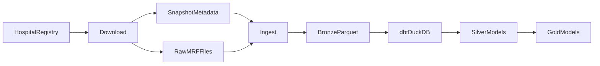
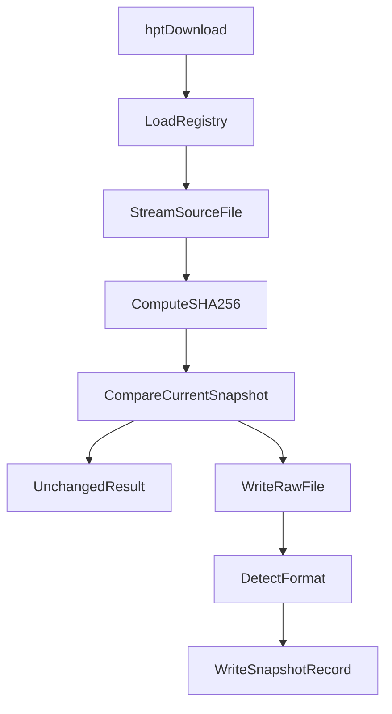
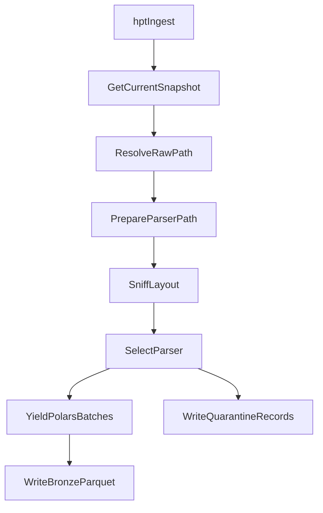

# Pipeline Overview

The implemented pipeline has two Python CLI phases followed by a dbt/DuckDB
modeling phase.

## Implemented Components

`hpt download` reads hospital sources from the active registry, streams each MRF
URL to temporary storage, hashes the bytes, compares the hash to the current
snapshot, and writes a new raw file plus Type-2 snapshot metadata only when the
source changed.

Important modules:

- `src/hpt/cli.py`
- `src/hpt/ingest/download.py`
- `src/hpt/ingest/client.py`
- `src/hpt/ingest/storage.py`
- `src/hpt/ingest/snapshot.py`
- `src/hpt/registry/loader.py`

`hpt ingest` resolves each hospital's current snapshot, materializes compressed
files when needed, sniffs the MRF layout, selects a parser, writes Bronze Parquet
batches, and sends validation failures to quarantine.

Important modules:

- `src/hpt/pipeline/ingest_snapshot.py`
- `src/hpt/ingest/mrf_sniffer.py`
- `src/hpt/ingest/compression.py`
- `src/hpt/parsers/json_mrf.py`
- `src/hpt/parsers/csv_tall.py`
- `src/hpt/parsers/csv_wide.py`
- `src/hpt/loaders/parquet.py`

`transform/` is the dbt project. It currently defines external Bronze Parquet
sources for DuckDB. Silver and Gold model directories exist, but production
models are not implemented yet.

## Download Flow

Key behavior:

- The registry controls which hospitals and URLs are targeted.
- File hashes prevent duplicate snapshots when downloaded bytes are unchanged.
- Raw storage and snapshot metadata share the same `fsspec` base URI.
- The `--force` flag forces a download attempt, but hash comparison still
  determines whether a new snapshot is written.

## Ingest Flow

Key behavior:

- Ingest operates on current snapshot metadata, not directly on arbitrary files.
- Compressed raw archives remain intact; parser-ready copies are materialized
  under temporary storage when needed.
- Parser outputs are grouped by Bronze table name.
- `BronzeWriter` writes partitioned Parquet parts under the Bronze root.

## Transform Flow

dbt reads Bronze Parquet through `dbt-duckdb` external source definitions in
`transform/models/staging/_bronze_sources.yml`.

Expected direction:

- Staging views read Bronze sources without changing grain.
- Silver tables normalize charge items, codes, hospitals, payers, plans,
  modifiers, dates, and source-specific quirks.
- Gold tables answer analysis questions such as price variation, hospital
  comparisons, payer comparisons, and compliance reporting.

## Boundaries

Python owns source acquisition, source tracking, structural parsing, and Bronze
file writing. dbt owns semantic normalization and analytics models. Airflow,
Docker, and Terraform folders exist as planned integration points, not active
runtime dependencies.
