# Silver Core Layer

Silver Core is the conformed business layer inside Silver. It starts from
validation-filtered Silver Base tables and adds the reviewed identities,
comparison keys, context fields, and deterministic item identities needed for
analysis. It does not replace Bronze evidence or Silver Base source fidelity.

The shortest way to understand the boundary is:

- Silver Base answers: what did this hospital file say, in a common relational
  shape?
- Silver Core answers: which parts of those rows are comparable, which payer or
  plan context do they represent, and how should the same hospital item be
  recognized across snapshots?

Core is intentionally row-preserving for the main facts. Bad, ambiguous, local,
or unmapped values usually receive status columns instead of being filtered out.
That design keeps source lineage intact and lets Gold models choose the
appropriate comparability filters for a specific question.

## Why Core Exists

Hospital price transparency MRFs are not simple price lists. A single row can
encode a chargemaster item, a cash price, de-identified negotiated ranges,
identified payer rates, formula-based contracts, code systems, modifiers,
locations, drug units, and payer-plan labels. Those fields are only analytically
useful when their business meaning is explicit.

Silver Base standardizes structure across JSON, CSV Tall, and CSV Wide. Silver
Core adds the project-specific business interpretation that should be stable
enough for downstream analysis:

- Broad canonical payer identity.
- Payer and plan context, separate from payer identity.
- Billing-code match keys and format status.
- Cross-hospital code comparability flags.
- Modifier and professional/technical split enrichment.
- Drug unit enrichment.
- Payer-rate modifier signatures.
- Within-hospital cross-snapshot service-item identity.

Core is not a Gold layer. It does not decide which cohort is "the right" cohort
for a dashboard. It gives Gold enough typed and audited building blocks to make
those choices explicitly.

## Industry Mental Model

The CMS hospital price transparency file is a hospital-published disclosure of
standard charges. It is not a claims dataset, a patient estimate, or proof of
final out-of-pocket cost.

Important charge concepts:

| Concept | Meaning | Core implication |
| --- | --- | --- |
| Gross charge | Hospital chargemaster list price | Useful context, rarely expected payment. |
| Discounted cash price | Cash or cash-equivalent price | Compare only to the same item and charge context. |
| Payer-specific negotiated charge | Contracted hospital-payer amount or formula | Keep payer, plan, methodology, setting, billing class, and modifiers attached. |
| De-identified min/max | Lowest and highest negotiated dollar charges without payer identity | Useful spread signals, not identified payer rates. |
| Allowed amount percentiles | Historical allowed amounts for some rate contexts | Not the same thing as negotiated charge and should not be mixed casually. |

The practical analytic unit is usually:

```text
hospital + snapshot + service item + billing code context + setting
+ billing class + modifier set + payer + plan + methodology + charge type
```

Dropping any of those dimensions can make comparisons misleading. A CPT rate
for outpatient facility billing is not the same economic object as an inpatient
DRG case rate, a professional component, a drug price with a different unit, or
a formula-based percentage of billed charges.

## Layer Boundaries

Silver Core reads from `transform/models/silver/base/` and the curated seeds in
`transform/seeds/`.

Core responsibilities:

- Add reviewed, auditable identities and context.
- Add deterministic matching keys and signatures.
- Preserve raw and cleaned fields inherited from Base.
- Preserve `snapshot_id`, `hospital_id`, source format, and source keys.
- Emit status and confidence fields when a value is not fully comparable.

Core should not:

- Drop rows because a payer, code, modifier, or drug unit is unmapped.
- Guess ambiguous NDC layouts or ambiguous plan types.
- Treat local CDM codes as cross-hospital clinical codes.
- Collapse payer products, programs, and market segments into payer identity.
- Create a cross-hospital service-item master.
- Rank prices or define analysis cohorts. That belongs in Gold.

## Model Map

```mermaid
flowchart TD
    subgraph Seeds
        CP[canonical_payers]
        PA[payer_aliases]
        PCR[payer_context_rules]
        CCT[cms_code_types]
        MR[modifier_reference]
        DUA[drug_unit_aliases]
    end

    subgraph Base["Silver Base"]
        BPR[slv_base__payer_rates]
        BSC[slv_base__standard_charges]
        BCI[slv_base__charge_items]
        BCC[slv_base__charge_item_codes]
        BCM[slv_base__charge_modifiers]
        BDI[slv_base__drug_information]
        BHS[slv_base__hospital_snapshots]
    end

    subgraph Core["Silver Core"]
        PAM[slv_core__payer_alias_matches]
        PCM[slv_core__payer_context_matches]
        RMS[slv_core__rate_modifier_signature]
        CPR[slv_core__payer_rates]
        CCC[slv_core__charge_item_codes]
        CCM[slv_core__charge_modifiers]
        CDI[slv_core__drug_information]
        CCI[slv_core__charge_items]
        CSI[slv_core__service_items]
    end

    BPR --> PAM
    BHS --> PAM
    PA --> PAM
    PAM --> PCM
    PCR --> PCM
    BPR --> PCM
    BHS --> PCM
    BPR --> CPR
    BSC --> CPR
    PAM --> CPR
    PCM --> CPR
    CP --> CPR
    BCM --> RMS
    BPR --> RMS
    RMS --> CPR
    BCC --> CCC
    CCT -. validates seed relationship .-> CCC
    BCM --> CCM
    MR --> CCM
    BDI --> CDI
    BCC --> CDI
    DUA --> CDI
    BCI --> CCI
    CCC --> CCI
    DUA --> CCI
    CCI --> CSI
    BHS --> CSI
```



| Model | Grain | Purpose |
| --- | --- | --- |
| `slv_core__payer_alias_matches` | One best match per matched payer-rate row | Resolves broad payer identity from accepted payer aliases. |
| `slv_core__payer_context_matches` | One best context match per matched payer-rate row | Adds market, program, product, benefit, funding, state, and plan-type context after payer identity is known. |
| `slv_core__payer_rates` | One row per Silver Base payer rate | Main conformed payer-rate fact with payer identity, context, setting, billing class, and modifier signature. |
| `slv_core__charge_item_codes` | One row per Silver Base item-code row | Adds match keys, code status, comparability, specificity, and NDC canonicalization. |
| `slv_core__charge_modifiers` | One row per Silver Base charge-modifier row | Adds CMS modifier reference metadata and professional/technical split flag. |
| `slv_core__drug_information` | One row per Silver Base drug-information row | Adds canonical unit and unit family status. |
| `slv_core__rate_modifier_signature` | One row per payer rate with modifiers | Builds sorted modifier-set signatures for comparable rate cohorts. |
| `slv_core__charge_items` | One row per Silver Base charge item | Adds content signatures and within-hospital `service_item_id`. |
| `slv_core__service_items` | One row per within-hospital service item | Cross-snapshot service-item dimension over retained Silver data. |

## Payer Identity And Payer Context

Payer names are one of the highest-risk normalization problems in HPT data. The
same payer may appear as a legal entity, a brand, a parent company, a third-party
administrator, a network, a Blue Cross licensee, an employer product, or a state
program. The same string can also mean different things in different states.

Core handles this by separating identity from context.

`canonical_payer_id` is the broad payer identity used for payer-level analysis:
examples include national payers, regional payers, payer brands, administrators,
networks, and BCBS licensees. It should not encode market segment, product,
network, benefit line, state program, or plan type.

Context columns describe the plan or program attached to the rate:

- `market_segment`: commercial, Medicare Advantage, Medicaid managed care,
  exchange marketplace, workers comp, TRICARE/VA, self-pay, other government,
  other, or unknown.
- `program_type`: a more specific program such as a state Medicaid program,
  D-SNP, VA CCN, or other named government/product program.
- `product_or_network_name`: product or network labels such as a PPO network,
  narrow network, or payer-specific product family.
- `subsidiary_or_brand`: operating brand detail when it should not replace the
  broad payer identity.
- `benefit_line`: medical, dental, vision, behavioral health, transplant, or
  unknown.
- `funding_arrangement`: funding details when detectable, such as level-funded
  arrangements.
- `context_state`: state context implied by the product or program.
- `plan_type`: structural network type such as PPO, HMO, POS, EPO, PFFS, or
  HDHP.

### Alias Matching

`slv_core__payer_alias_matches` joins `slv_base__payer_rates.clean_payer_name`
to accepted, active `payer_aliases` rows where `match_type = 'exact_clean'`.
State-scoped aliases are allowed and are preferred over global aliases when the
hospital snapshot state matches. Among remaining candidates, the ranking favors
stronger validation status and then deterministic alias ID order.

Rows that do not match an alias are not removed. In `slv_core__payer_rates`,
they keep their source payer fields and receive:

```text
payer_match_basis = 'unmatched'
payer_review_status = 'candidate'
canonical_payer_id = null
```

That makes missing payer mappings visible to review queues without hiding rate
rows from analysis.

### Context Matching

`slv_core__payer_context_matches` only runs after identity resolution. Context
rules are scoped to a resolved `source_canonical_payer_id`; they cannot override
the payer identity.

Accepted, active `payer_context_rules` can match by:

- exact cleaned plan name,
- cleaned payer name,
- plan substring,
- whole-token contains,
- regex,
- optional source cleaned payer constraint,
- optional state scope.

When multiple rules match, lower `priority` wins first. The remaining sort order
prefers state-scoped rules, more exact match types, longer plan patterns, and
deterministic rule IDs. The result is one best context rule per payer-rate row.

This design matters because "Aetna PPO", "Aetna Medicare Advantage", and
"Aetna Better Health Medicaid" should usually share broad payer identity where
appropriate, but they should not be treated as the same market or product.

### Plan Type Fallback

Some plan names contain a structural token like PPO or HMO even when no curated
context rule exists. `slv_core__payer_rates` therefore falls back to
`hpt_derive_plan_type(clean_plan_name)` only when a context rule did not already
supply `plan_type`.

The fallback is deliberately conservative:

- It matches only whole-word tokens: `ppo`, `hmo`, `pos`, `epo`, `pffs`, `hdhp`.
- It returns a value only when exactly one distinct token is present.
- It returns null for no token or ambiguous multi-token names.
- It never feeds `market_segment`.
- It is tracked through `plan_type_basis`.

This avoids treating coded suffixes, dental DHMO labels, or mixed plan strings
as clean structural plan types.

## Payer-Rate Fact Logic

`slv_core__payer_rates` is the main Core fact table for negotiated rates. It is
row-preserving over `slv_base__payer_rates`, with enrichment columns added.

The model carries:

- Base payer-rate fields: payer name, plan name, negotiated dollar,
  percentage, algorithm, methodology, allowed amount fields, and lineage.
- Denormalized standard-charge context: `clean_setting` and
  `clean_billing_class`.
- Modifier context: `modifier_signature` and `modifier_count`.
- Payer identity: `canonical_payer_id`, canonical payer name, parent payer, and
  payer type.
- Payer context: market, program, product, brand, benefit, funding, state, plan
  type, and confidence/review metadata.

Industry interpretation depends heavily on `methodology`:

| Methodology | What the value usually means | Analysis caution |
| --- | --- | --- |
| `fee schedule` | Scheduled amount for the item/code | Most directly comparable when item, setting, billing class, modifiers, and payer context align. |
| `percent of total billed charges` | Often a precomputed dollar equal to percent times gross charge | Algorithm text and gross charge matter; dollar may become stale if gross charge changes. |
| `case rate` | Flat payment for an episode or bundle | Do not compare as if it were a line-item procedure fee. |
| `per diem` | Daily inpatient rate | Compare only to similar inpatient/day contexts. |
| `other` | Catch-all, often compound contract text | Algorithm text can encode carve-outs, caps, thresholds, fee schedules, or percent-of-charges components. |

Core does not try to convert every methodology into one universal dollar value.
It preserves methodology, negotiated fields, and algorithm text so Gold can
filter or classify the rates according to the analytic question.

## Billing-Code Enrichment

Billing codes are the strongest available anchor for comparing hospital items,
but not all code systems mean the same thing.

Common code systems:

| Code system | Meaning | Core treatment |
| --- | --- | --- |
| CPT | Procedure/service code, often outpatient or professional | Specific and cross-hospital comparable when format is valid. |
| HCPCS | Supplies, drugs, outpatient services, and CPT-like codes | Specific and cross-hospital comparable when format is valid. |
| NDC | Drug product code | Specific, but needs canonical NDC and drug unit context. |
| DRG family | Inpatient case grouping | Specific, generally episode/case-rate context. |
| APC | Medicare outpatient payment grouping | Specific payment grouping. |
| Revenue code (`rc`) | Hospital department/revenue category | Cross-hospital standardized but categorical, not item-specific. |
| CDM | Hospital chargemaster/internal code | Useful within hospital, not cross-hospital comparable. |
| LOCAL | Hospital local code | Useful within hospital, not cross-hospital comparable. |
| ICD | Diagnosis/procedure context | Treated cautiously; diagnosis is not the priced service by itself. |

`slv_core__charge_item_codes` keeps every Base code row and adds:

- `match_code`: the derived join key used for matching and signatures.
- `code_format_status`: valid, invalid, missing, unknown, or not validated.
- `code_cross_hospital_comparable`: false for CDM, LOCAL, missing, or unknown
  systems.
- `code_is_specific`: true only for systems that pin down a specific item or
  clinically meaningful pricing group.
- `clean_ndc`, `canonical_ndc_11`, and `ndc_format_status` for NDC rows.

Important implementation details:

- Revenue codes are zero-padded to 4 digits.
- DRG-family numeric codes are zero-padded to 3 digits.
- APC numeric codes are normalized to 4 digits, including handling observed
  over-padded values.
- NDCs become canonical 11-digit values only when the source is already
  11 digits or a hyphenated 10-digit layout reveals the missing segment
  (`4-4-2`, `5-3-2`, or `5-4-1`).
- Ambiguous unhyphenated 10-digit NDCs are flagged, not guessed.
- `clean_code` remains source-faithful. Matching uses derived fields.

The split between `code_cross_hospital_comparable` and `code_is_specific` is
important. Revenue codes are standardized across hospitals, so they are
comparable as categories, but they are not specific enough to identify one
service item. CDM and LOCAL codes may be useful within one hospital over time,
but they should not create cross-hospital service cohorts.

## Modifiers And Rate Comparability

Modifiers are short billing codes that can materially change what a rate means.
They can indicate laterality, technical/professional components, supplies,
therapy details, payment adjustments, or other billing conditions.

`slv_core__charge_modifiers` joins `modifier_reference` to each Base modifier
row and adds:

- `match_modifier_code`,
- `modifier_class`,
- `modifier_category`,
- `modifier_meaning`,
- `affects_pro_tech_split`,
- `modifier_reference_status`.

The `affects_pro_tech_split` flag is especially important for modifiers `26`
and `TC`. Modifier `26` usually represents the professional component; `TC`
usually represents the technical component. A global service, professional
component, and technical component should not be averaged together as if they
were the same rate.

`slv_core__rate_modifier_signature` fans standard-charge modifiers down to every
payer rate under the standard charge and builds a sorted distinct modifier-set
hash. `slv_core__payer_rates` uses that as `modifier_signature`; rates with no
modifiers receive the sentinel hash for `<no_modifiers>`.

The signature makes modifier context joinable and comparable at payer-rate
grain. Gold cohorts should generally include modifier signature or an explicit
modifier filter.

## Drug Information

Drug price comparison needs both product identity and unit context. NDC can
identify the product/package, but the disclosed unit tells what quantity basis
the price uses.

`slv_core__drug_information` enriches Base drug rows through
`drug_unit_aliases`:

- `canonical_drug_unit_type`: canonical unit token such as `each`, `unit`,
  `international_unit`, `mg`, `g`, or `ml`.
- `drug_unit_group`: count, activity, mass, or volume.
- `drug_unit_status`: canonical, unknown unit, or missing unit.
- `item_has_ndc_code`: whether the parent item carries an NDC.
- `ndc_item_missing_drug_unit`: guardrail for NDC-coded items missing unit type.

Core deliberately does not perform cross-unit quantity conversion. Count and
activity units do not share a universal base, and even mass or volume conversion
would need careful product-specific assumptions. The safe rule is that drug
quantities are only comparable within compatible unit context.

## Service-Item Identity

The source data does not provide a stable item ID across snapshots. JSON item
ordinals and CSV row numbers are file-local. Silver Base IDs are snapshot-scoped
by design. Tracking price changes over time therefore requires a derived
identity.

`slv_core__charge_items` derives a within-hospital `service_item_id` using
deterministic signatures:

- `description_token_signature`: lowercased, punctuation-stripped, sorted
  distinct description tokens, with a tiny abbreviation expansion set
  (`w/o`, `w/`, `&`). Digits are preserved because drug strengths and sizes are
  often meaningful.
- `code_signature_specific`: sorted distinct `(system, match_code)` pairs for
  specific code systems only.
- `code_signature_all`: sorted distinct full code set.
- `drug_signature`: NDC code set plus canonical drug unit type, excluding the
  pricing quantity `drug_unit`.

Identity basis is explicit:

| Basis | When used | Confidence |
| --- | --- | --- |
| `specific_code` | Specific clinical/payment codes exist | High |
| `categorical_code` | Only categorical or local codes exist | Medium |
| `uncoded` | No usable code exists | Low |

For specific-coded items, the service item ID uses hospital, specific code
signature, description token signature, and drug signature. When only
categorical codes exist, it uses hospital, all-code signature, description, and
drug signature. For uncoded items, it uses hospital, description, and drug
signature.

Setting and billing class are deliberately excluded from item identity. They
describe charge context, not the underlying item. They remain available on the
standard-charge and payer-rate facts and must still be used for rate comparison.

`slv_core__service_items` rolls `slv_core__charge_items` up to one row per
within-hospital `service_item_id` across retained snapshots. It records first
and last seen snapshot, representative recent description, snapshot count,
source item count, and distinct description count.

Under the default `current_only` retention mode, each hospital keeps one current
snapshot in Silver, so `snapshot_count = 1` is expected. Cross-snapshot
continuity becomes meaningful when retained Silver data includes multiple
snapshots under `all_snapshots`.

This identity is intentionally not cross-hospital. Cross-hospital comparison
should be built in Gold from code cohorts, setting, billing class, modifiers,
drug context, payer context, and methodology filters.

## Review Queues And Audit Views

Core mapping is maintained by small, auditable seeds and supporting review
queues. The important pattern is that unmapped values become work queues, not
silent exclusions.

Relevant review queues include:

- `slv_review_queue__payer_candidates`: unmatched payer names.
- `slv_review_queue__payer_plan_candidates`: unmatched payer-plan combinations.
- `slv_review_queue__plan_context_candidates`: missing or weak context coverage.
- `slv_review_queue__code_system_candidates`: unrecognized code systems.
- `slv_review_queue__modifier_candidates`: modifier values without reference
  coverage.

Relevant audit views include:

- `slv_audit__code_validation_findings`: code-format and comparability findings.
- `slv_audit__service_item_overmerge`: signals where service-item identity may
  have absorbed too many source items or descriptions.
- `slv_audit__plan_context_coverage`: payer context and plan-type coverage by
  canonical payer.

Audit views are finding surfaces. They are not accept/reject workflows.

## Materialization And Scoped Runs

Most Silver Core models inherit the project Silver materialization:
incremental `snapshot_replace` keyed by `snapshot_id`. Scoped dbt runs replace
the requested snapshot slice without rebuilding the entire corpus.

Ephemeral helper models:

- `slv_core__payer_alias_matches`
- `slv_core__payer_context_matches`
- `slv_core__rate_modifier_signature`

Cross-snapshot exception:

- `slv_core__service_items` is a full-refresh table over retained Silver Core
  charge items. It reads unscoped inputs by design, because a snapshot-scoped
  run must not shrink a cross-snapshot dimension to the one snapshot being
  rebuilt.

Agent and developer validation should use the `hpt run-dbt` wrapper with one
explicit snapshot and the smallest selector that exercises the change. For Core
changes, that usually means:

```bash
hpt run-dbt \
  --snapshot-ids 97e28644-a4fc-4b3c-9c5c-8e9cf650500e \
  --command build \
  --selector silver_core
```

Use a different pinned snapshot when the change specifically depends on CSV
Tall, CSV Wide, JSON structure, or row volume.

## How To Analyze From Core

Use Core by choosing the narrowest grain that matches the question.

For payer-rate comparisons:

- Start from `slv_core__payer_rates`.
- Join to `slv_core__charge_items` for `service_item_id` and item identity
  confidence.
- Join to `slv_core__charge_item_codes` when building code cohorts.
- Filter to compatible `methodology` values.
- Keep `clean_setting`, `clean_billing_class`, and `modifier_signature` aligned.
- Keep payer context fields visible; do not average Medicare Advantage,
  Medicaid, commercial, and exchange rows unless the analysis explicitly asks
  for that rollup.

For cross-hospital service cohorts:

- Do not join hospitals on `service_item_id`; it is within-hospital only.
- Use comparable and specific billing codes, then apply setting, billing class,
  modifiers, drug unit context, methodology, and payer/plan context.
- Treat revenue-code-only cohorts as broad categories.
- Exclude or separately label CDM/LOCAL-only rows for cross-hospital analysis.

For hospital price-over-time analysis:

- Use `service_item_id` within a hospital.
- Use `slv_core__service_items` for first/last seen and continuity signals.
- Compare rates only after preserving rate context: payer, plan, methodology,
  setting, billing class, and modifiers.
- Expect limited continuity while Silver retention is `current_only`.

For drug analysis:

- Require valid NDC canonicalization when product identity matters.
- Keep `canonical_drug_unit_type` and `drug_unit_group` in the cohort.
- Avoid cross-unit conversion unless a later Gold model explicitly implements a
  defensible conversion method.

## Common Pitfalls

- Treating `canonical_payer_id` as a plan. It is broad payer identity; plan and
  program details live in context columns.
- Comparing negotiated dollar, percentage, and algorithm rows as one numeric
  measure without methodology filters.
- Using CDM or LOCAL codes for cross-hospital cohorts.
- Treating revenue codes as specific services.
- Ignoring modifier signature, especially professional and technical component
  splits.
- Comparing drug prices without unit context.
- Treating `service_item_id` as cross-hospital identity.
- Assuming unmatched payer rows are unusable; they are usable source rows with
  missing canonical identity.
- Assuming Core status fields are hard filters. They are analytic controls.

## Source Files

Primary Core models:

- `transform/models/silver/core/slv_core__payer_rates.sql`
- `transform/models/silver/core/slv_core__charge_item_codes.sql`
- `transform/models/silver/core/slv_core__charge_items.sql`
- `transform/models/silver/core/slv_core__service_items.sql`
- `transform/models/silver/core/slv_core__charge_modifiers.sql`
- `transform/models/silver/core/slv_core__drug_information.sql`

Mapping and reference seeds:

- `transform/seeds/canonical_payers.csv`
- `transform/seeds/payer_aliases.csv`
- `transform/seeds/payer_context_rules.csv`
- `transform/seeds/cms_code_types.csv`
- `transform/seeds/modifier_reference.csv`
- `transform/seeds/drug_unit_aliases.csv`

Supporting decisions and domain references:

- `docs/decisions/0005-split-silver-base-and-silver-core.md`
- `docs/decisions/0009-normalize-payers-as-identity-plus-context.md`
- `docs/decisions/0013-normalize-billing-codes-as-enrichment.md`
- `docs/decisions/0014-derive-service-item-identity-deterministically.md`
- `docs/local/industry_guide.md`
- `docs/local/methodologies_algorithms.md`
