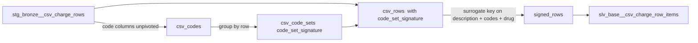
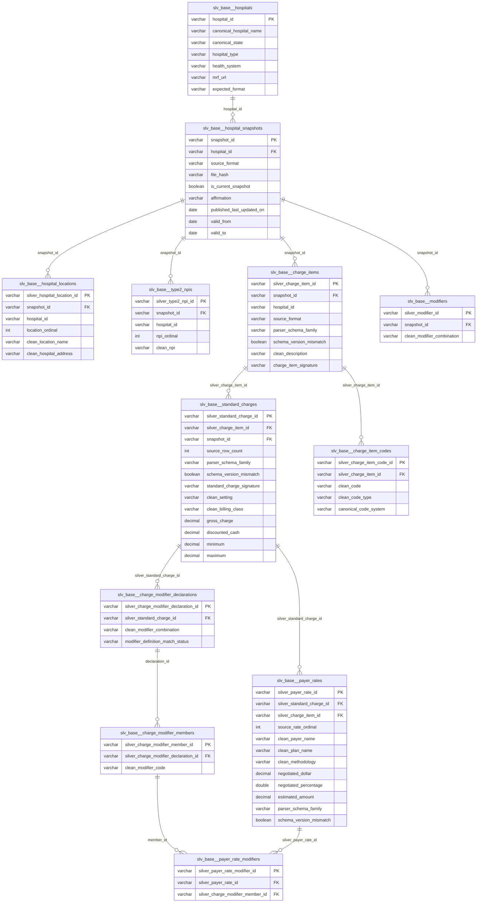

# Silver Base Schema — dbt Pipeline Reference

This document traces how each model in `transform/models/silver/base/` is built,
including source dependencies, key transformations, and column schemas. It is
intended as a companion to the reference image captured on 2026-05-20.

Reference image: `docs/local/diagrams/hps_silver_2026-5-20.png`

---

## Pipeline DAG

The diagram below shows every staging source and silver model, grouped by layer,
with arrows indicating `ref()` dependencies.

```mermaid
flowchart TD
    subgraph Seeds
        H[hospitals]
    end

    subgraph Staging["Staging — Bronze Sources"]
        S1[stg_bronze__hospital_mrf_snapshots]
        S2[stg_bronze__hospital_locations]
        S3[stg_bronze__type2_npi]
        S4[stg_bronze__standard_charge_info]
        S5[stg_bronze__drug_information]
        S6[stg_bronze__standard_charges]
        S7[stg_bronze__code_information]
        S8[stg_bronze__payers_information]
        S9[stg_bronze__csv_charge_rows]
        S10[stg_bronze__standard_charge_modifiers]
        S11[stg_bronze__modifiers]
        S12[stg_bronze__modifier_payer_info]
        S13[stg_bronze__general_contract_provisions]
        S14[stg_bronze__csv_modifier_rows]
        S15[stg_bronze__csv_modifier_members]
    end

    subgraph Silver["Silver Base Models"]
        M1[slv_base__hospitals]
        M2[slv_base__hospital_snapshots]
        M3[slv_base__hospital_locations]
        M4[slv_base__type2_npis]
        M5[slv_base__csv_charge_row_items]
        M6[slv_base__charge_items]
        M7[slv_base__standard_charges]
        M8[slv_base__modifiers]
        M9[slv_base__charge_item_codes]
        M10[slv_base__payer_rates]
        M11[slv_base__charge_modifier_declarations]
        M12[slv_base__charge_modifier_members]
        M13[slv_base__payer_rate_modifiers]
        M14[slv_base__drug_information]
        M15[slv_base__general_contract_provisions]
        M16[slv_base__modifier_payer_info]
    end

    H --> M1
    S1 --> M2
    M1 --> M2

    S2 --> M3
    M2 --> M3

    S3 --> M4
    M2 --> M4

    S9 --> M5

    S4 --> M6
    S5 --> M6
    M2 --> M6
    M5 --> M6

    S6 --> M7
    S9 --> M7
    M6 --> M7
    M5 --> M7
    M2 --> M7

    S11 --> M8
    S14 --> M8
    M2 --> M8

    S7 --> M9
    S9 --> M9
    M6 --> M9
    M5 --> M9

    S8 --> M10
    S9 --> M10
    M7 --> M10

    S10 --> M11
    S9 --> M11
    S14 --> M11
    M5 --> M11
    M7 --> M11
    M8 --> M11
    M11 --> M12
    M10 --> M13
    M12 --> M13
    S5 --> M14
    M6 --> M14
    S13 --> M15
    M2 --> M15
    S12 --> M16
    S9 --> M16
    M8 --> M16
```

---

## Dual-Path Pattern

Every model that touches charge data handles two source formats in parallel and
`UNION ALL`s them into a single output grain:

| Path | Source grain | Surrogate key seed |
|------|--------------|--------------------|
| **JSON** | `standard_charge_information` objects from structured MRF JSON | `snapshot_id + 'json' + source ordinal/id` |
| **CSV** | flat rows from `csv_charge_rows` (Tall or Wide-unpivoted) | `snapshot_id + 'csv' + row_ordinal` |

CSV charge items are pre-grouped by `slv_base__csv_charge_row_items` before
being joined into the main models, which allows many-to-one row → item
deduplication.

---

## Model Reference

### `slv_base__hospitals`

**Source:** `hospitals` seed  
**Purpose:** Registry-backed hospital dimension. Provides canonical identity
for every hospital that has ever been downloaded.

| Column | Type | Notes |
|--------|------|-------|
| `hospital_id` | varchar PK | Registry identifier |
| `canonical_hospital_name` | varchar | |
| `clean_canonical_hospital_name` | varchar | Lowercased/stripped form |
| `canonical_state` | varchar | |
| `hospital_type` | varchar | |
| `health_system` | varchar | |
| `mrf_url` | varchar | |
| `expected_format` | varchar | |

---

### `slv_base__hospital_snapshots`

**Sources:** `stg_bronze__hospital_mrf_snapshots`, `slv_base__hospitals`  
**Purpose:** One row per ingested MRF file. Joins registry identity onto the
snapshot and casts raw date strings to typed columns.

| Column | Type | Notes |
|--------|------|-------|
| `snapshot_id` | varchar PK | |
| `hospital_id` | varchar FK → hospitals | |
| `canonical_hospital_name` | varchar | From registry |
| `canonical_state` | varchar | From registry |
| `hospital_type` | varchar | From registry |
| `health_system` | varchar | From registry |
| `raw_reported_hospital_name` | varchar | Source-preserved |
| `clean_reported_hospital_name` | varchar | |
| `source_url` | varchar | |
| `source_file_name` | varchar | |
| `source_format` | varchar | `json`, `csv_tall`, `csv_wide` |
| `file_hash` | varchar | Ingest-time hash |
| `raw_ingested_at` | varchar | |
| `ingested_at` | timestamp | |
| `raw_published_last_updated_on` | varchar | |
| `published_last_updated_on` | date | |
| `schema_version` | varchar | |
| `is_current_snapshot` | boolean | Derived (not stored): latest `valid_from` per hospital |
| `raw_valid_from` | varchar | |
| `valid_from` | date | |
| `valid_to` | date | Derived: `valid_from` of the superseding snapshot; null if current |
| `attestation` | varchar | |
| `confirm_attestation` | varchar | |
| `attester_name` | varchar | |
| `affirmation` | varchar | v2 JSON source field |
| `confirm_affirmation` | varchar | v2 JSON source field |
| `reported_state` | varchar | |
| `license_number` | varchar | |

---

### `slv_base__hospital_locations`

**Sources:** `stg_bronze__hospital_locations`, `slv_base__hospital_snapshots`  
**Purpose:** Source-reported locations for each snapshot. One row per
`(snapshot_id, location_ordinal)`.

| Column | Type | Notes |
|--------|------|-------|
| `silver_hospital_location_id` | varchar PK | Surrogate on `snapshot_id + location_ordinal` |
| `snapshot_id` | varchar FK → hospital_snapshots | |
| `hospital_id` | varchar | Denormalized from snapshot |
| `source_format` | varchar | |
| `location_ordinal` | integer | Source position |
| `raw_location_name` | varchar | |
| `clean_location_name` | varchar | |
| `raw_hospital_address` | varchar | |
| `clean_hospital_address` | varchar | |

---

### `slv_base__type2_npis`

**Sources:** `stg_bronze__type2_npi`, `slv_base__hospital_snapshots`  
**Purpose:** Source-reported Type-2 NPIs for each snapshot. One row per
`(snapshot_id, npi_ordinal)`.

| Column | Type | Notes |
|--------|------|-------|
| `silver_type2_npi_id` | varchar PK | Surrogate on `snapshot_id + npi_ordinal` |
| `snapshot_id` | varchar FK → hospital_snapshots | |
| `hospital_id` | varchar | Denormalized |
| `source_format` | varchar | |
| `npi_ordinal` | integer | Source position |
| `raw_npi` | varchar | |
| `clean_npi` | varchar | |

---

### `slv_base__csv_charge_row_items` *(helper bridge)*

**Source:** `stg_bronze__csv_charge_rows`  
**Purpose:** Maps every CSV source row to a synthesized, deduplication-keyed
charge item. Computes a `charge_item_signature` from description + code set +
drug info so that rows describing the same logical item share one
`silver_charge_item_id`.

| Column | Type | Notes |
|--------|------|-------|
| `silver_charge_item_id` | varchar | Shared key for deduplication groups |
| `charge_item_signature` | varchar | MD5 hash of description + code set + drug |
| `snapshot_id` | varchar | |
| `row_ordinal` | integer | Original CSV row position |
| `source_format` | varchar | |
| `raw_description` | varchar | |
| `clean_description` | varchar | |
| `code_set_signature` | varchar | MD5 of ordered code values |
| `drug_unit` | varchar | |
| `raw_drug_unit_type` | varchar | |
| `clean_drug_unit_type` | varchar | |

---

### `slv_base__charge_items`

**Sources:** `stg_bronze__standard_charge_info`, `stg_bronze__drug_information`,
`slv_base__hospital_snapshots`, `slv_base__csv_charge_row_items`  
**Purpose:** Format-neutral item/service table. JSON items come one-per-row from
`standard_charge_info`; CSV items are deduplicated groups of rows sharing the
same `charge_item_signature`.

| Column | Type | Notes |
|--------|------|-------|
| `silver_charge_item_id` | varchar PK | |
| `snapshot_id` | varchar FK → hospital_snapshots | |
| `hospital_id` | varchar | |
| `source_format` | varchar | |
| `source_charge_item_id` | varchar | JSON only; null for CSV |
| `source_item_ordinal` | integer | JSON only; `min(row_ordinal)` for CSV |
| `first_source_row_ordinal` | integer | CSV only; null for JSON |
| `last_source_row_ordinal` | integer | CSV only; null for JSON |
| `source_row_count` | integer | Always 1 for JSON |
| `reported_schema_version` | varchar | JSON parser lineage; null for CSV |
| `reported_schema_family` | varchar | JSON parser lineage; null for CSV |
| `parser_schema_family` | varchar | JSON parser lineage; null for CSV |
| `parser_schema_version` | varchar | JSON parser lineage; null for CSV |
| `schema_version_mismatch` | boolean | True when inferred JSON record family differs from reported file family |
| `raw_description` | varchar | |
| `clean_description` | varchar | |
| `drug_unit` | varchar | |
| `raw_drug_unit_type` | varchar | |
| `clean_drug_unit_type` | varchar | |
| `charge_item_signature` | varchar | Deduplication key |

---

### `slv_base__standard_charges`

**Sources:** `stg_bronze__standard_charges`, `stg_bronze__csv_charge_rows`,
`slv_base__charge_items`, `slv_base__csv_charge_row_items`,
`slv_base__hospital_snapshots`  
**Purpose:** Format-neutral charge context. Holds setting, billing class, and
the five generic amounts (`gross_charge`, `discounted_cash`, `minimum`,
`maximum`, plus notes). Each JSON `standard_charge` row produces one record.
CSV rows are grouped into one standard-charge context per synthesized charge
item, generic charge fields, modifier string, and generic notes; payer-specific
rows remain in `slv_base__payer_rates`.

| Column | Type | Notes |
|--------|------|-------|
| `silver_standard_charge_id` | varchar PK | |
| `silver_charge_item_id` | varchar FK → charge_items | |
| `snapshot_id` | varchar FK → hospital_snapshots | |
| `hospital_id` | varchar | |
| `source_format` | varchar | |
| `source_standard_charge_id` | varchar | JSON only; null for CSV |
| `source_charge_ordinal` | integer | JSON only; null for CSV |
| `source_row_ordinal` | integer | Representative CSV row ordinal; null for JSON |
| `first_source_row_ordinal` | integer | First CSV row represented by the grouped charge context; null for JSON |
| `last_source_row_ordinal` | integer | Last CSV row represented by the grouped charge context; null for JSON |
| `source_row_count` | integer | Count of distinct CSV source rows represented; `1` for JSON |
| `reported_schema_version` | varchar | JSON parser lineage; null for CSV |
| `reported_schema_family` | varchar | JSON parser lineage; null for CSV |
| `parser_schema_family` | varchar | JSON parser lineage; null for CSV |
| `parser_schema_version` | varchar | JSON parser lineage; null for CSV |
| `schema_version_mismatch` | boolean | True when inferred JSON record family differs from reported file family |
| `standard_charge_signature` | varchar | Deterministic charge-context signature used when source IDs do not exist |
| `raw_setting` | varchar | |
| `clean_setting` | varchar | |
| `raw_billing_class` | varchar | |
| `clean_billing_class` | varchar | |
| `gross_charge` | decimal(18,4) | |
| `discounted_cash` | decimal(18,4) | |
| `minimum` | decimal(18,4) | |
| `maximum` | decimal(18,4) | |
| `additional_generic_notes` | varchar | |

---

### `slv_base__modifiers`

**Sources:** `stg_bronze__modifiers`, `stg_bronze__csv_modifier_rows`,
`slv_base__hospital_snapshots`  
**Purpose:** Format-neutral modifier-rule definitions. JSON top-level
`modifier_information` rows and accepted standalone CSV modifier rows retain
their native source grains. Full combinations such as `50|62` remain one rule.

| Column | Type | Notes |
|--------|------|-------|
| `silver_modifier_id` | varchar PK | |
| `definition_kind` | varchar | `json_definition` or `csv_standalone_rule` |
| `source_modifier_code_id` | varchar | JSON Bronze key |
| `source_row_ordinal` | integer | CSV standalone-rule source row |
| `snapshot_id` | varchar FK → hospital_snapshots | |
| `hospital_id` | varchar | |
| `source_format` | varchar | |
| `raw_modifier_combination` | varchar | Full source combination |
| `clean_modifier_combination` | varchar | Ordered cleaned full combination |
| `raw_description` | varchar | |
| `clean_description` | varchar | |
| `raw_setting` | varchar | |
| `clean_setting` | varchar | |
| `member_count` | integer | Nonblank ordered members in the full combination |

---

### `slv_base__charge_item_codes`

**Sources:** `stg_bronze__code_information`, `stg_bronze__csv_charge_rows`,
`slv_base__charge_items`, `slv_base__csv_charge_row_items`  
**Purpose:** Exploded billing codes attached to Silver charge items. JSON codes
come from `code_information`; CSV codes are unpivoted from the fixed code
columns in `csv_charge_rows` and then deduplicated back to one row per unique
`(charge_item, code)`.

| Column | Type | Notes |
|--------|------|-------|
| `silver_charge_item_code_id` | varchar PK | Surrogate on `silver_charge_item_id + ordinal + raw_code + raw_code_type` |
| `silver_charge_item_id` | varchar FK → charge_items | |
| `snapshot_id` | varchar | |
| `hospital_id` | varchar | |
| `source_format` | varchar | |
| `code_ordinal` | integer | Position within item |
| `raw_code` | varchar | |
| `clean_code` | varchar | |
| `raw_code_type` | varchar | |
| `clean_code_type` | varchar | |
| `canonical_code_system` | varchar | Lowercase CMS HPT code system when `clean_code_type` matches `cms_code_types.code_type`; null otherwise |
| `source_code_path` | varchar | `json_code_information` or `csv_charge_rows` |

---

### `slv_base__payer_rates`

**Sources:** `stg_bronze__payers_information`, `stg_bronze__csv_charge_rows`,
`slv_base__standard_charges`  
**Purpose:** Format-neutral payer and plan negotiated rate rows linked to a
`silver_standard_charge_id`. JSON rates come from `payers_information`; CSV
rates come directly from the charge row with payer/plan columns.

| Column | Type | Notes |
|--------|------|-------|
| `silver_payer_rate_id` | varchar PK | |
| `silver_standard_charge_id` | varchar FK → standard_charges | |
| `silver_charge_item_id` | varchar FK → charge_items | |
| `snapshot_id` | varchar | |
| `hospital_id` | varchar | |
| `source_format` | varchar | |
| `source_standard_charge_id` | varchar | JSON only; null for CSV |
| `source_charge_ordinal` | integer | JSON only; null for CSV |
| `source_row_ordinal` | integer | CSV only; null for JSON |
| `source_rate_ordinal` | integer | CSV rate ordinal within a source row; null for JSON |
| `reported_schema_version` | varchar | JSON parser lineage; null for CSV |
| `reported_schema_family` | varchar | JSON parser lineage; null for CSV |
| `parser_schema_family` | varchar | JSON parser lineage; null for CSV |
| `parser_schema_version` | varchar | JSON parser lineage; null for CSV |
| `schema_version_mismatch` | boolean | True when inferred JSON record family differs from reported file family |
| `payer_ordinal` | integer | JSON only; null for CSV |
| `raw_payer_name` | varchar | |
| `clean_payer_name` | varchar | |
| `raw_plan_name` | varchar | |
| `clean_plan_name` | varchar | |
| `raw_methodology` | varchar | |
| `clean_methodology` | varchar | |
| `negotiated_dollar` | decimal(18,4) | |
| `negotiated_percentage` | double | |
| `negotiated_algorithm` | varchar | |
| `estimated_amount` | decimal(18,4) | v2.2 JSON estimated amount for algorithm/percentage charges |
| `median_amount` | decimal(18,4) | |
| `tenth_percentile` | decimal(18,4) | |
| `ninetieth_percentile` | decimal(18,4) | |
| `raw_count` | varchar | Source-preserved string |
| `additional_payer_notes` | varchar | |

---

### Modifier Usage Models

`slv_base__charge_modifier_declarations` stores one full modifier combination
attached to an accepted standard charge. JSON declarations use the source
standard-charge modifier ordinal; item-associated CSV declarations use the
original source `row_ordinal`. Exact full-combination and compatible-setting
resolution produces `resolved_exact`, `unresolved`, or `ambiguous`; ambiguous
definitions are never selected arbitrarily.

`slv_base__charge_modifier_members` splits each accepted declaration into
ordered, nonblank member tokens while retaining the declaration foreign key.
Duplicate members are source-faithful and remain distinct by ordinal.

`slv_base__payer_rate_modifiers` fans CSV declaration members out only to
accepted payer rates from the same source row. It preserves both
`source_row_ordinal` and `source_rate_ordinal`. JSON declarations remain
charge-level because JSON attaches modifiers to the parent standard charge.

---

## Entity Relationship Overview

---

## Comparison Notes — Reference Image vs. Implemented Models

The reference image (`hps_silver_2026-5-20.png`) shows a schema captured from
the target design. Key differences to be aware of:

| Image table name | Implemented model | Notes |
|------------------|-------------------|-------|
| `hospital` | `slv_base__hospitals` | Matches |
| `hospital_mrf_snapshots` | `slv_base__hospital_snapshots` | Implemented model adds `canonical_*` and typed date columns from registry join |
| `hospital_locations` | `slv_base__hospital_locations` | Matches; raw/clean column pairs added |
| `type2_npl` (sic) | `slv_base__type2_npis` | Matches |
| `standard_charge_info` | `slv_base__charge_items` | Renamed for format-neutrality; CSV deduplication logic added |
| `standard_charges` | `slv_base__standard_charges` | Matches for JSON; CSV rows are grouped into charge contexts with source-row aggregate lineage |
| `code_information` | `slv_base__charge_item_codes` | Renamed; `canonical_code_system` and `source_code_path` added |
| `modifiers` | `slv_base__modifiers` | Expanded with CSV standalone modifier rules |
| `standard_charge_modifiers` | `slv_base__charge_modifier_declarations`, `slv_base__charge_modifier_members`, `slv_base__payer_rate_modifiers` | Split into full declaration, ordered member, and accepted payer-rate relationship grains |
| `payers_information` | `slv_base__payer_rates` | Renamed; CSV path added |
| *(not in image)* | `slv_base__csv_charge_row_items` | Helper bridge unique to the CSV path; pre-deduplicates CSV rows before `charge_items` |
| `modifier_payer_info` | `slv_base__modifier_payer_info` | Expanded with CSV standalone-rule payer adjustments and notes |

### Modifier Migration

`slv_base__charge_modifiers` was removed as an intentional breaking schema
change. A normal incremental deployment does not drop an existing physical
relation after its model file is deleted. Deployment therefore requires an
externally managed full rebuild or explicit relation cleanup; agent verification
must remain snapshot-scoped and must not perform that full rebuild.
